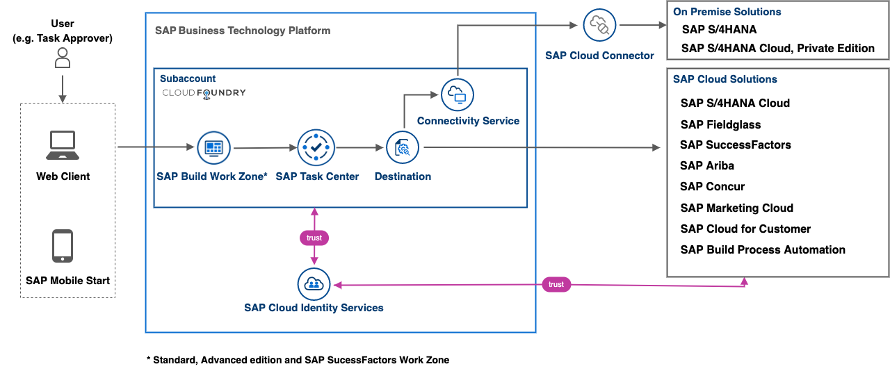

# SAP Task Center - SAP Discovery Center Missions and Reusable Content
<!--- Register repository https://api.reuse.software/register, then add REUSE badge:

-->

## Description

This repository provides an overview of the released and planned SAP Task Center missions, and includes content that can be reused by them. 

Here is an overview of the missions, related to SAP Task Center:

- Initial Setup of the SAP Task Center Service on SAP Business Technology Platform (SAP BTP) [(link to SAP Discovery Center mission)](https://discovery-center.cloud.sap/protected/index.html#/missiondetail/3774/)
- SAP Task Center Integration with SAP SuccessFactors [(link to SAP Discovery Center mission)](https://discovery-center.cloud.sap/protected/index.html#/missiondetail/3816/)
- SAP Task Center Integration with SAP S/4HANA Cloud [(link to SAP Discovery Center mission)](https://discovery-center.cloud.sap/index.html#/missiondetail/3906)
- SAP Task Center Integration with SAP S/4HANA [(link to SAP Discovery Center mission)](https://discovery-center.cloud.sap/index.html#/missiondetail/3910/)
- SAP Task Center Integration with SAP Fieldglass [(link to SAP Discovery Center mission)](https://discovery-center.cloud.sap/index.html#/missiondetail/3911/)
- SAP Task Center Integration with SAP Concur (not supported yet)
- SAP Task Center Integration with SAP Ariba [(link to SAP Discovery Center mission)]()
- SAP Task Center Integration with SAP Process Automation [(link to SAP Discovery Center mission)]()

### SAP BTP Solution Diagram

## Requirements
To start with the setup of SAP Task Center, you must have completed the prerequisites in [Automatic Setup](https://help.sap.com/viewer/08cbda59b4954e93abb2ec85f1db399d/Cloud/en-US/3a499676e7ae4282af84092f778e3737.html) (or [Manual Setup](https://help.sap.com/viewer/08cbda59b4954e93abb2ec85f1db399d/Cloud/en-US/0f00d3d3e2ab460c856d409c469fb4f1.html), if you prefer to set up SAP Task Center manually). 

## Known Issues
You can find some known issues and suggested solutions in the troubleshooting guide for SAP Task Center. Take a look at the [Guided Answers for SAP Task Center](https://ga.support.sap.com/dtp/viewer/index.html#/tree/3109/actions/47627) as well as the [Guided Answers](https://ga.support.sap.com/dtp/viewer/index.html#/tree/2065/actions/26547) section for SAP Business Technology Platform (SAP BTP) on the SAP Support Portal.

## How to obtain support
If you couldn’t find a solution in the [Guided Answers for SAP Task Center](https://ga.support.sap.com/dtp/viewer/index.html#/tree/3109/actions/47627), you can report an incident or error through the [SAP Support Portal](https://support.sap.com/en/index.html). Please use the respective component for your incident, as described in [SAP Note 3044195](https://launchpad.support.sap.com/#/notes/3044195).
When submitting the incident, we recommend you to include the following information:
-	Landscape information (for example, Canary, EU10, US10)
-	The URL of the page where the incident or error occurs
-	The steps or clicks used to replicate the error
-	Screenshots, videos, or the code entered

[Create an issue](https://github.com/SAP-samples/btp-task-center-integration/issues) in this repository if you find a bug or have questions about the content.
 
For additional support, [ask a question in SAP Community](https://answers.sap.com/questions/ask.html).

## Contributing
If you wish to contribute code, offer fixes or improvements, please send a pull request. Due to legal reasons, contributors will be asked to accept a DCO when they create the first pull request to this project. This happens in an automated fashion during the submission process. SAP uses [the standard DCO text of the Linux Foundation](https://developercertificate.org/).

## License
Copyright (c) 2022 SAP SE or an SAP affiliate company. All rights reserved. This project is licensed under the Apache Software License, version 2.0 except as noted otherwise in the [LICENSE](LICENSES/Apache-2.0.txt) file.
