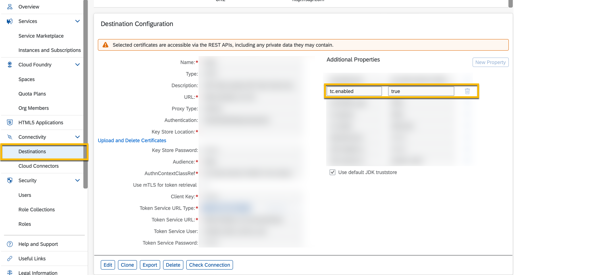
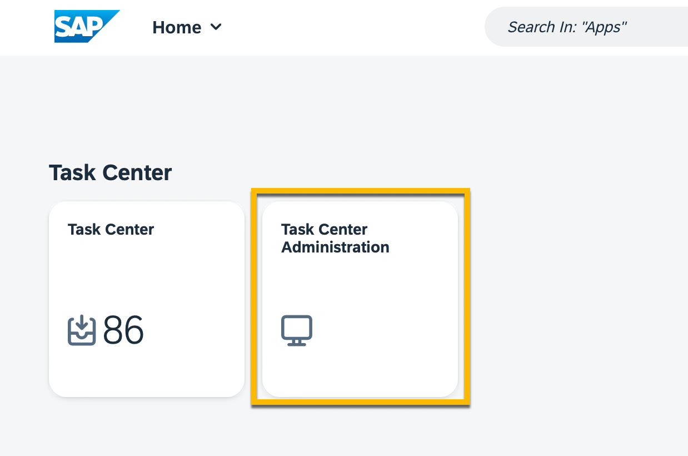
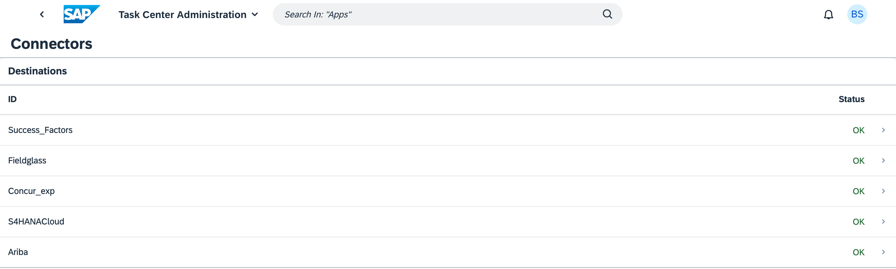
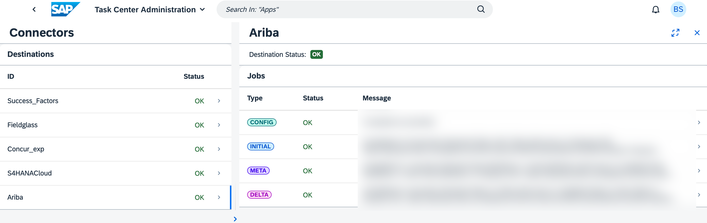

## Troubleshooting guide:

Tasks not visible on the SAP Task Center’s Web UI?

Updating of the Task failed?

Need to repopulate the Task Cache?

### Solution:

Use the **tc.enabled** property to repopulate tasks and task definitions in the SAP Task Center task cache.
To delete and repopulate the task cache for a destination, you have to remove the **tc.enabled** property for this destination and add it again in a few minutes.

### Procedure:
1.	Navigate to the Cloud Foundry subaccount, where your SAP Task Center instance was created, and select the Connectivity  Destinations tab from the navigation area on the left.

2.	Open the destination configuration of the task provier, for which you want to repopulate the task cache and verify that the **tc.enabled** property is enabled.

3.	Open the Task Center Administration app [See Working with the Task Center Administration App](https://help.sap.com/docs/TASK_CENTER/08cbda59b4954e93abb2ec85f1db399d/3a1598cb4b774536befb701f78b36e48.html?locale=en-US) and verify that the connector to this destination is listed below the destinations.

4.	Go back to the destination configuration in your Cloud Foundry subacount and switch to edit mode. Search for **tc.enabled** below **Additional Properties**, and remove the property. Save your changes.

5.	Go back to the Task Center Administration app and wait until the connector to the destination is not visible anymore.

6.	Back in your Cloud Foundry subaccount, open the destination configuration in edit mode, choose **New Property** and add **tc.enabled** with value **true**. Save the configuration. This allows the jobs in the background to fetch all tasks and task definitions from the task provider system.

7.	The destination connector should be visible again in the Task Center Administration app. Make sure that the **INITIAL** job is visible, and the **CONFIG** job is with status **OK** .

### Results:

The task cache is now repopulated for this destination. You should be able to see all tasks from the past 90 days from this destination.