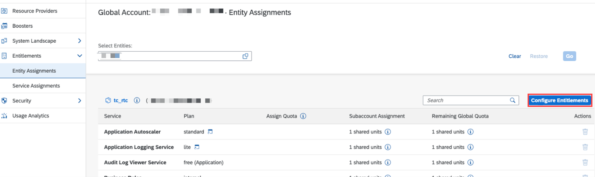
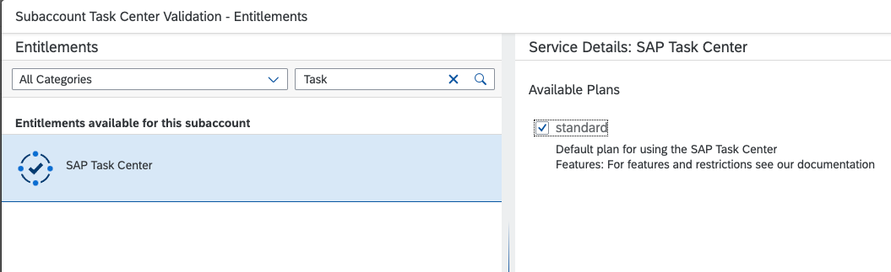
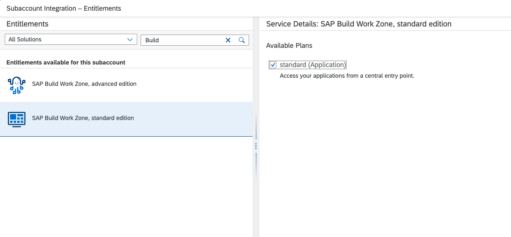
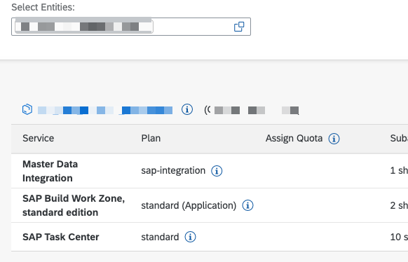

## Prerequisites

SAP Task Center requires the following SAP BTP services:

- [SAP Launchpad service](https://help.sap.com/viewer/product/Launchpad_Service/Cloud/en-US)
- [SAP Cloud Identity Services - Identity Authentication](https://discovery-center.cloud.sap/#/serviceCatalog/44f005fe-ae27-4b70-878e-e2429f88d642)
- [SAP Cloud Identity Services - Identity Provisioning](https://help.sap.com/viewer/p/IDENTITY_PROVISIONING)

To check whether these services are entitled in the SAP BTP subaccount, see [Managing Entitlements and Quotas Using the Cockpit](https://help.sap.com/products/BTP/65de2977205c403bbc107264b8eccf4b/c8248745dde24afb91479361de336111.html?version=Cloud), especially how to [Configure Entitlements and Quotas for Subaccounts](https://help.sap.com/products/BTP/65de2977205c403bbc107264b8eccf4b/c8248745dde24afb91479361de336111.html?version=Cloud).

## Check the availability of SAP BTP services

1. For SAP BTP services like SAP Task Center and SAP Launchpad service, access the SAP BTP cockpit and choose **Entitlements > Entity Assignments**.
You must be the account administrator of the global account.

2. Then choose your subaccount and validate the availability of the services:
- SAP Task Center (free of charge, see the details about service plan)
- SAP Launchpad service

3. Additionally, check that **SAP Cloud Identity Services - Identity Authentication** and SAP Cloud Identity Services - Identity Provisioning are available.
4. If a service is missing, add the entitlements manually.

## Add entitlements manually
**Please note that to check and add the entitlements, you need to have the administrator role assigned.**

1. Choose Configure Entitlements.

2. Add **SAP Task Center**.

3. Add **SAP Build Work Zone, standard edition**.

4. Add the services (service plans) to your subaccount.

5. **Save** your changes.

**Congratulations!** As a result, you should now see SAP Launchpad service and SAP Task Center in the list of the entity assignments for the specific subaccount in SAP BTP.

