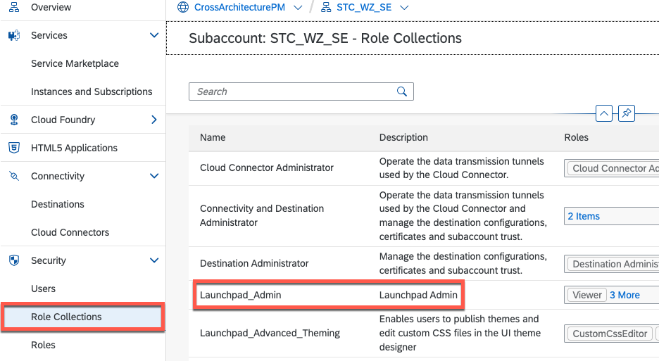
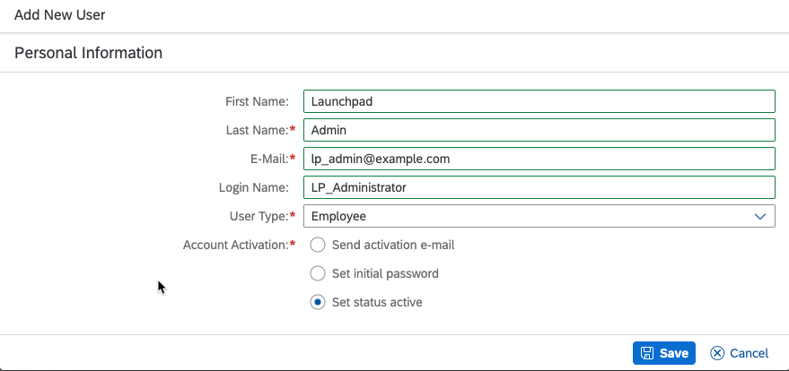
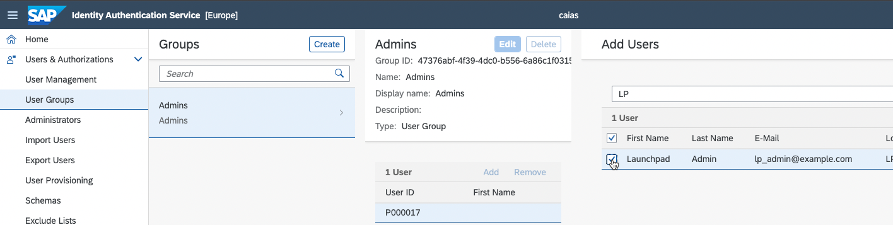
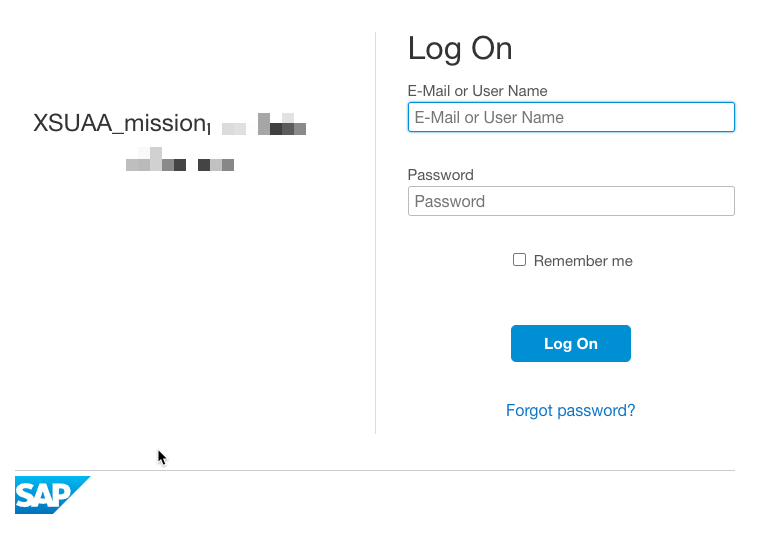
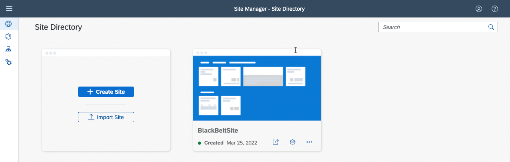

## Introduction

In this section we need to grant access to an "admin" user, who will maintain the SAP Build Work Zone, standard edition service site via the [Site Manager](https://help.sap.com/viewer/8c8e1958338140699bd4811b37b82ece/Cloud/en-US/3f619a13ca2a4a59a14bec8507c3fb69.html).

## Adjust SAP Build Work Zone Role Collection

The first step is now to modify the **Launchpad_Admin** role collection.
In your SAP Business Technology Platform (SAP BTP) subaccount navigate to **Security > Role Collections**, and choose the **Launchpad_Admin** entry:

Select the role collection, open in the edit mode and select the **User Groups** tab.
Choose the **+** button and add a group name in the **Name** field (this needs to match the group from SAP Cloud Identity Services - Identity Authentication). In this example the group is called *Admins*. Save your changes.

* **Background: With this assignment it's possible to automatically assign users (stored in SAP Cloud Identity Services) to the role collection.**
In the next step we will finalize the configuration in SAP Cloud Identity Services - Identiy Authentication.

## User Creation In SAP Cloud Identity Services - Identiy Authentication

Log in to the Identity Authentication tenant which is connected to your SAP BTP subaccount, were SAP Task Center is running.
- Open the **User Management** tile and create a user, for example:

Now switch to **User Groups** and create a new group or, like in this example, edit the **Admins** group and add the previously created user:

For more information about how to create a user, see [Create Users](https://help.sap.com/products/BTP/65de2977205c403bbc107264b8eccf4b/a3bc7e863ac54c23ab856863b681c9f8.html).

## Validate the Identity Authentication Setup

To validate the trust setup, open SAP Build Work Zone, standard edition.
1. In the SAP BTP cockpit, navigate to **Services > Instances and Subscriptions**.
2. To open the application, choose the **Go to Application** icon.

If you now log on with valid Identity Authentication credentials you should change the password. 

Afterwards you should get access to the SAP Build Work Zone, standard edition **Site Manager**:

## Result

With this we can now finish the last step, where we integrate the SAP Task Center applications, into a new SAP Build Work Zone site.
