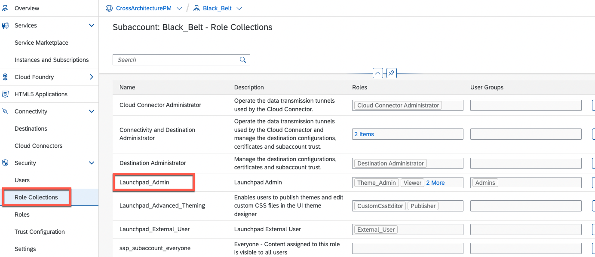
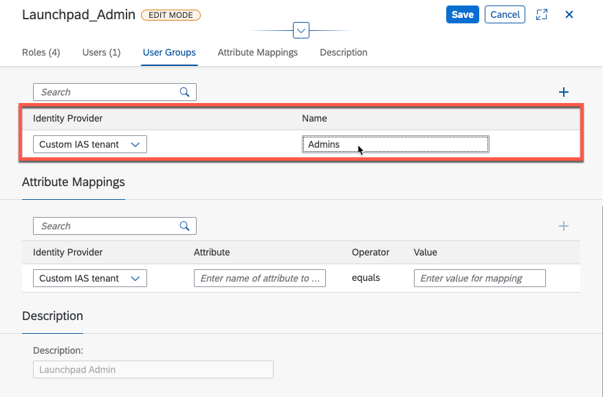

## Introduction

In this section, we need to grant access to a "admin" user who will maintain the SAP BTP launchpad site via the [Site Manager](https://help.sap.com/viewer/8c8e1958338140699bd4811b37b82ece/Cloud/en-US/3f619a13ca2a4a59a14bec8507c3fb69.html).

## Adjust SAP BTP Laucnhpad role collection

The first step is now to modify the **Launchpad_Admin** role collection.
Please navigate to **Security > Role Collections** and select the **Launchpad_Admin** erntry:

Select the role collection, switch in the edit mode and select the **User Groups** tab.
Click the **+** buton an enter in the **Name** a the group name (this needs to match with the group from Identiy Authentication), in this example *Admins* and save the changes:

*Background: With this assigment it's possible to automatically assign users (which are staored in SAP Cloud Identity service) to the role collection.
In the next step we will finalyze the configuartion on  SAP Cloud Identity services - Identiy Authentication.

## User creation on SAP Cloud Identity services - Identiy Authentication

Login to the SAP Cloud Identity services - Identiy Authentication tenant which is connected toh BTP Subaccount were SAP Task Center is running.
- Enter the **User Management** tile and create a user, example:

Now switch to the **User Groups** and create a new group or as shown here in this example to edit the **Admins** group an add the previously created user:

