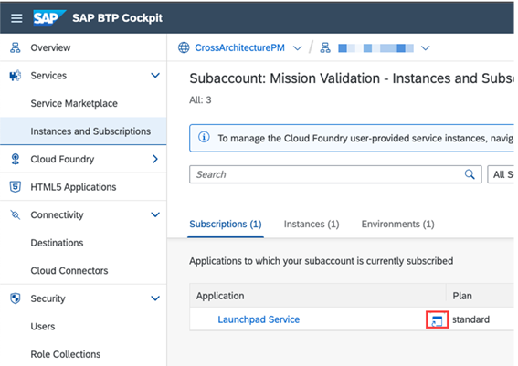
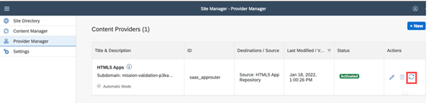
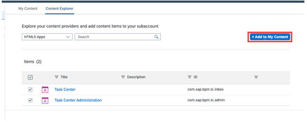
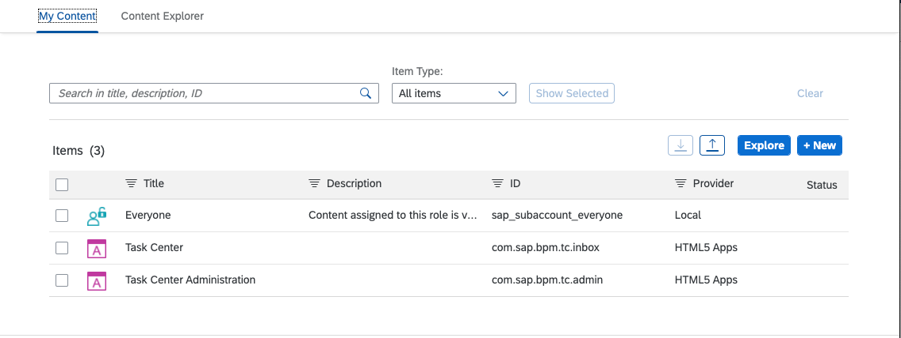
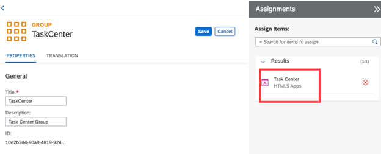
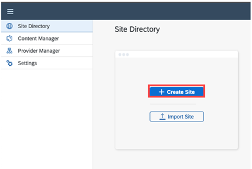
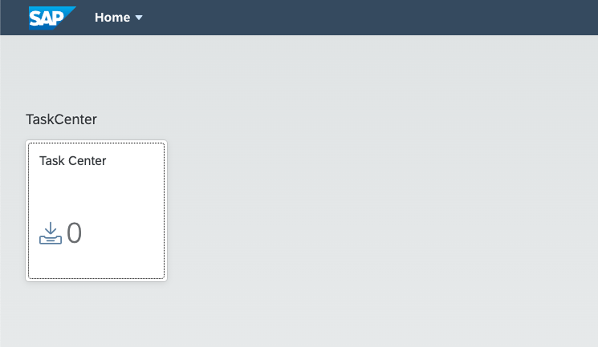
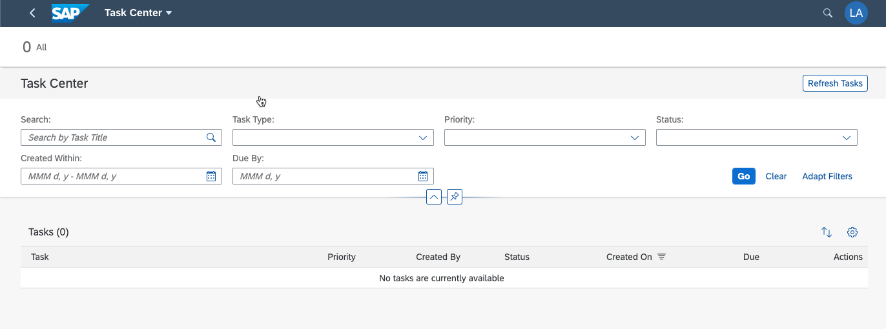

## Introduction

In this section, you finish the integration of SAP Task Center with SAP Launchpad service.

## Update content to get SAP Task Center applications

1. Access again the **Site Manager** from the SAP BTP cockpit.
2. From the navigation menu, choose **Instances and Subscriptions**.
3. Choose **Go to Application**.

4. From the navigation menu, choose **Provider Manager**.

5. Refresh the **HTML5 Apps** list.

6. Choose Content Manager, and then choose the HTML 5 Apps tile.

## Add SAP Task Center applications to the launchpad content

7. Select the Task Center applications, and choose **Add to My Content**.

8. Go back to the **My Content tab**, and verify that the SAP Task Center applications are displayed.

## Create group & assign SAP Task Center application

9. Create a new group with a name of your choice, and assign the **SAP Task Center** application.

10. In the Content Manager, assign Task Center to the existing everyone role.

[assign app to everyone role](images/btp_assign_app_2_role.png)

Alternatively, create a new role. For more information, see [Assign Content to a Role](https://help.sap.com/viewer/8c8e1958338140699bd4811b37b82ece/Cloud/en-US/baeaf6ee364e48ac95dc09470281f174.html).

## Create a new lauchpad site

To integrate SAP Task Center, you need to [create a Launchpad site](https://help.sap.com/viewer/8c8e1958338140699bd4811b37b82ece/Cloud/en-US/5778444e0419462bb4060a66a5c20de0.html).
This can be realized by following this:

- Create a **new site** and privide a name for the new site:

- Open the created site:

As result you should now see the SAP BTP launchpad site and the integrated SAP Task Center applications:

And by selecting the SAP Task center web application you can also get an idea how SAP Task Center looks like:

**Congratulations!** With this last step, you finished the initial setup for SAP Task Center.

For more information, see [SAP Task Center](https://help.sap.com/viewer/product/TASK_CENTER/Cloud/en-US).