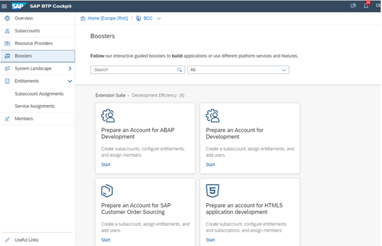
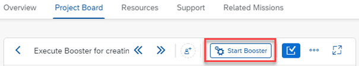
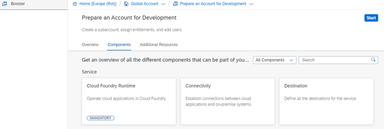
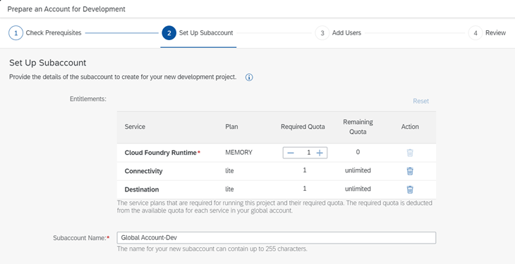

## Run the booster to automatically create a subaccount

A booster is a set of guided interactive steps that enable you to select, configure, and consume services in the SAP BTP cockpit for achieving defined tasks in the configuration.

You find boosters under the **Boosters** navigation entry in your global account.

The **Prepare an Account for Development** booster creates a Cloud Foundry subaccount for developing applications. Step by step, the booster assigns a curated set of entitlements, creates a subaccount, configures services, and sets up authorizations. In the background, it enables Cloud Foundry, creates a default space, and assigns users to specific roles.

1. To access the booster, choose Start Booster at the top right of your card and choose your global enterprise account from the dropdown.
Trial accounts are not supported, the user must be a global administrator.
    

2. In the boosters’ overview, choose the **Prepare an Account for Development** booster, read its **Overview** description, and check the required components.

You must have an entitlement for the Cloud Foundry Runtime service.

3. To start the booster, choose **Start**.
If the authorizations and entitlements are correct, the prerequisites are marked in green.

4. Choose **Next** to continue.

5. In the **Set Up Subaccount** step, enter a name for your subaccount. Choose your provider, region, subdomain for your URL, Org name, and a Space name (typically DEV, Test, or PROD).

6. In the **Add Users** step, enter a subaccount administrator user for the subdomain.

7. In the **Review** step, check your summary before you run the booster.

8. To run the booster, choose **Finish**.

After completion of the booster, you can access the subaccount and adapt the configuration further.