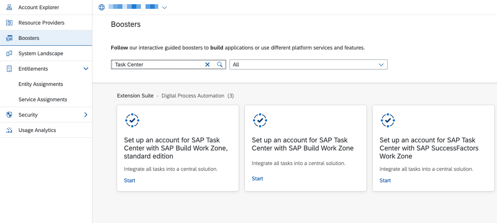
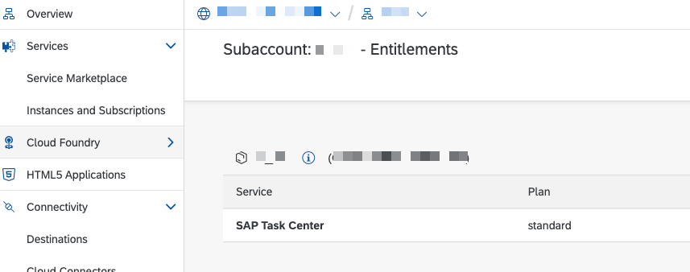
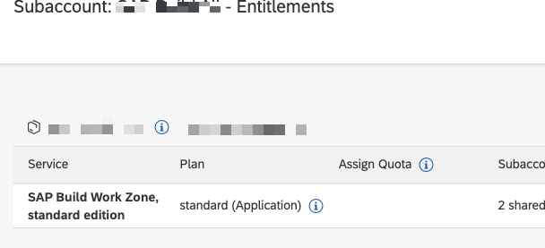
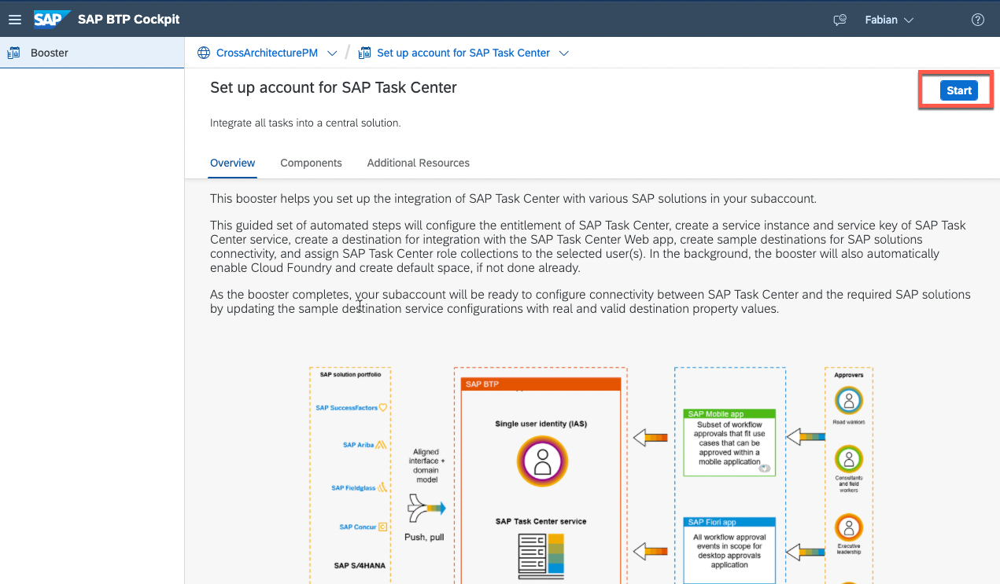
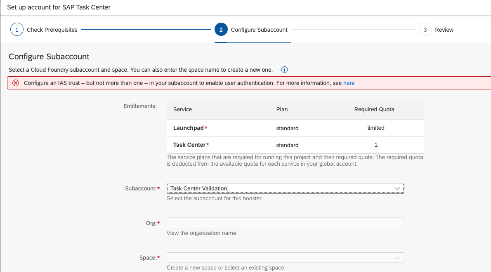
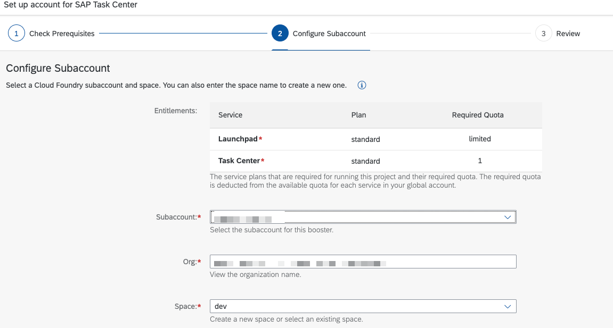
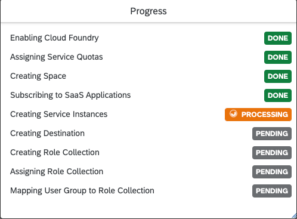
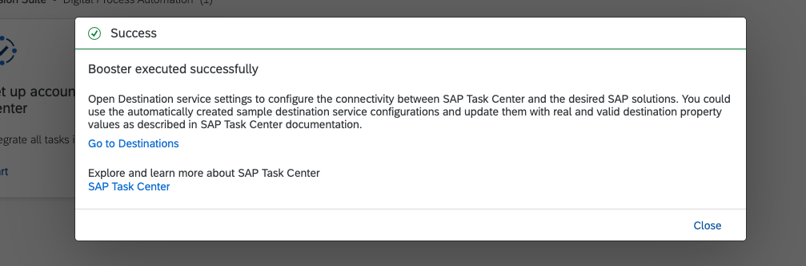

## Introduction

To speed up the setup process, SAP Task Center provides a booster to automate certain steps.
The booster is run on global account level.

For general information about accounts, subaccounts, administration, and operation within SAP BTP, see [Relationship Between Global Accounts and Subaccounts [Feature Set A]](https://help.sap.com/products/BTP/65de2977205c403bbc107264b8eccf4b/8ed4a705efa0431b910056c0acdbf377.html?version=Cloud#loioeeda449cf252418a97e0f7c9abd30b9a)

For more information about boosters, see [Boosters](https://help.sap.com/products/BTP/65de2977205c403bbc107264b8eccf4b/fb1b56148f834749a2bf51127421610b.html).

## Prerequisites

Ensure that the following prerequisites are met:

- Trust is set up between the target subaccount and the **Identity Authentication service**.
- To ensure the availability of the services, choose **Entitlements** from the navigation menu and search for:

- **SAP Task Center**

    
   

- **SAP Build Work Zone, standard edition**

    

## Procedure

1. From the navigation menu, choose Boosters to display a list of the available **boosters**.
2. Search for the **Set up an account for SAP Task Center with SAP Build Work Zone, standard edition** booster.

3. To enter the booster, choose Start.

In the following steps, the booster validates the prerequisites and informs you if entitlements are missing:

If all prerequisites are met, no error is shown.

4. In the **Review** step, you can review your entries.

5. The booster displays its progress in a popup.

Finally, a popup informs you about the success.

**Congratulations!** With the successful execution of the **SAP Task Center booster** you can move to the next step. You’ll set up SAP Build Work Zone, standard edition to access the SAP Task Center web application!

For more information about the automatic setup of SAP Task Center, see [Automatic Setup](https://help.sap.com/viewer/08cbda59b4954e93abb2ec85f1db399d/Cloud/en-US/3a499676e7ae4282af84092f778e3737.html).