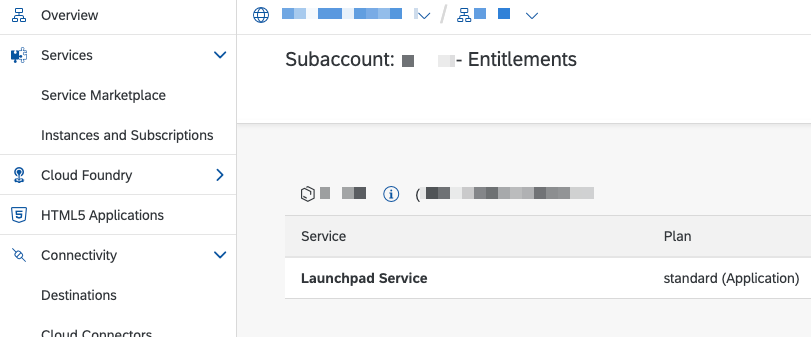
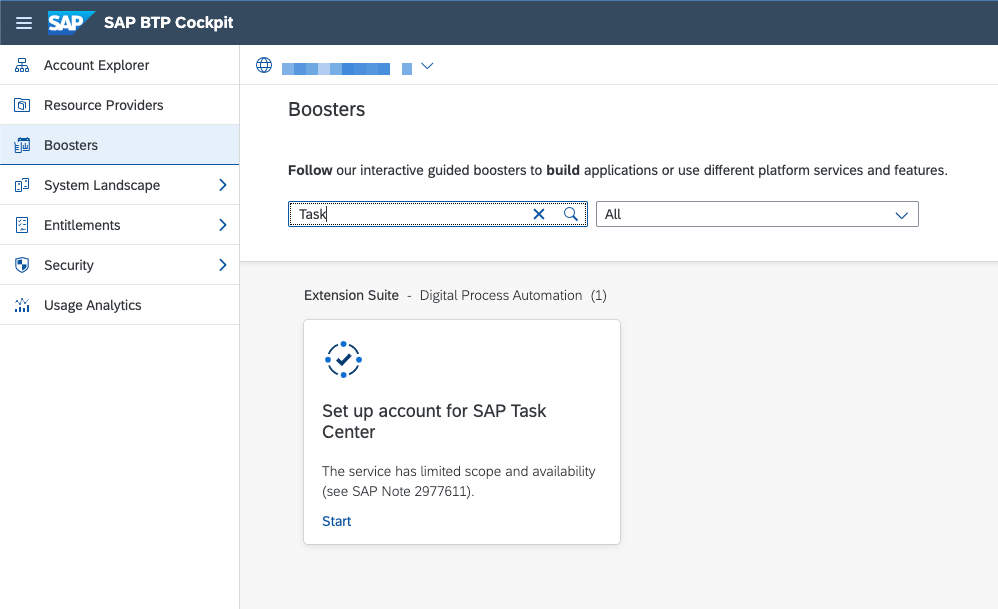

# Introduction

To speed up the setup process, SAP Task Center provides a booster to automate certain steps.
The booster is run on global account level.

For general information about accounts, subaccounts, administration, and operation within SAP BTP, see [Relationship Between Global Accounts and Subaccounts [Feature Set A]](https://help.sap.com/products/BTP/65de2977205c403bbc107264b8eccf4b/8ed4a705efa0431b910056c0acdbf377.html?version=Cloud#loioeeda449cf252418a97e0f7c9abd30b9a)

For more information about boosters, see [Boosters](https://help.sap.com/products/BTP/65de2977205c403bbc107264b8eccf4b/fb1b56148f834749a2bf51127421610b.html).

## Prerequisites

Ensure that the following prerequisites are met:

- Trust is set up between the target subaccount and the Identity Authentication service.
- To ensure the availability of the services, choose Entitlements from the navigation menu and search for:
    - SAP Task Center
    
    - SAP Launchpad Service
    

## Procedure

1. From the navigation menu, choose Boosters to display a list of the available boosters.
2. Search for the Set up account for SAP Task Center booster.
    
3. To enter the booster, choose Start.
    