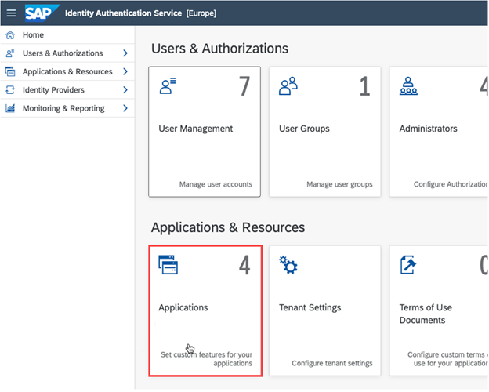
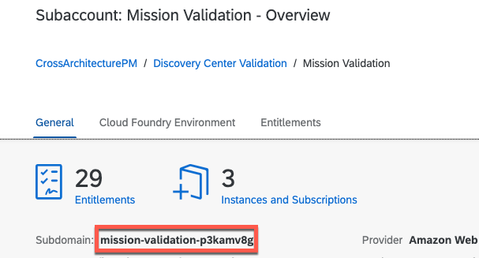

## Configuration to establish trust of your subaccount

To enable trust in your subaccount on SAP BTP, see also [Establish Trust and Federation Between UAA and Identity Authentication](https://help.sap.com/products/BTP/65de2977205c403bbc107264b8eccf4b/161f8f0cfac64c4fa2d973bc5f08a894.html).

Choose one of the following options:

- [Automatic trust setup](https://help.sap.com/viewer/65de2977205c403bbc107264b8eccf4b/Cloud/en-US/b9f4b0dc967040c99c7c8268ce335cce.html?q=establish%20trust) (described below)
- [Manual trust setup](https://help.sap.com/products/BTP/65de2977205c403bbc107264b8eccf4b/36214a93a8864662996a0d0814f3e1b7.html?q=establish%20trust%3Fq%3Destablish%20trust)

## Automatic trust setup

In your subaccount, you can establish automatic trust that is set up with the following steps:

1. From the navigation menu, choose **Security > Trust Configuration**.

2. Choose **Establish Trust**, and select the Identity Authentication tenant that you want to connect with your subaccount.

Info: Only tenants that belong to your customer ID are shown.

As result, the Identity Authentication tenant is displayed as custom entry and you can use it in your subaccount.

3. (Optional) Enter the Identity Authentication using the following URL:

**https://<Identity_Authentication_tenant>.accounts.ondemand.com/admin**

In the Identity Authentication service, navigate to **Applications & Resources**.

Identity Authentication:

SAP BTP cockpit:

**Congratulations!** With this step you have finalized the setup of the trust configuration for your BTP sub account.
