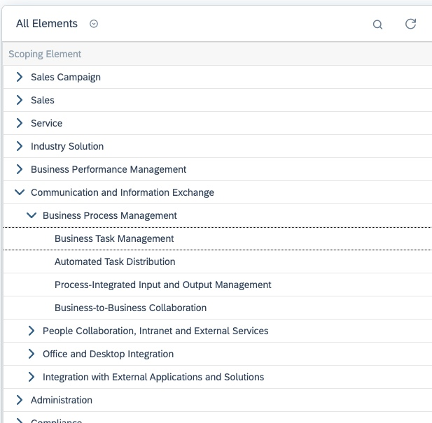
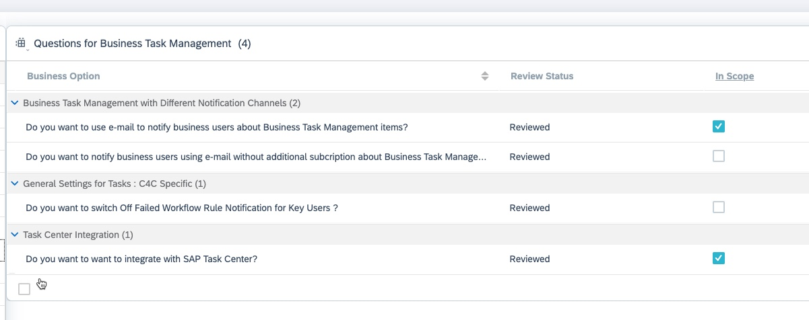

## Configure SAP Task Center in SAP Cloud for Customer

As an administrator, you must first configure SAP Task Center using the scoping question.

1.  Navigate to **Business Configuration > Implementation Projects**

2.	Select your project and navigate to **Edit Project > Scope  Questions > Communication and Information Exchange >  Business Process Management > Business Task Management > Task Center Integration** and select the scoping question.

