# Creating Approval Tasks in SAP Cloud for Customer - Opportunity Approval

Note: **UserID** to be used in the following steps should have necessary roles and authorization related to the Business Object: Opportunity.

**Pre-requisites**

1. **Scope-in Multi-Step Approval for Opportunities in Business Configuration**

    * Login with your **UserID**.
    * Go to **Business Configuration** → **Implementation Projects**. Select the project **First Implementation** and choose **Edit Project Scope**.
    * In the guided activity page, choose **Next** twice to reach the step 3 - **Review Questions**.
    * On the left navigation tree for **Scoping Element**, select **Sales** → **New Business** → **Opportunities**.
    * Select **'In Scope'** for the question **'Do you want to use a multiple step approval process for opportunities...'** and then choose **Next**.
    
      
      
    * Add a **Title** and **Description** (optional) and choose **Finish**.

      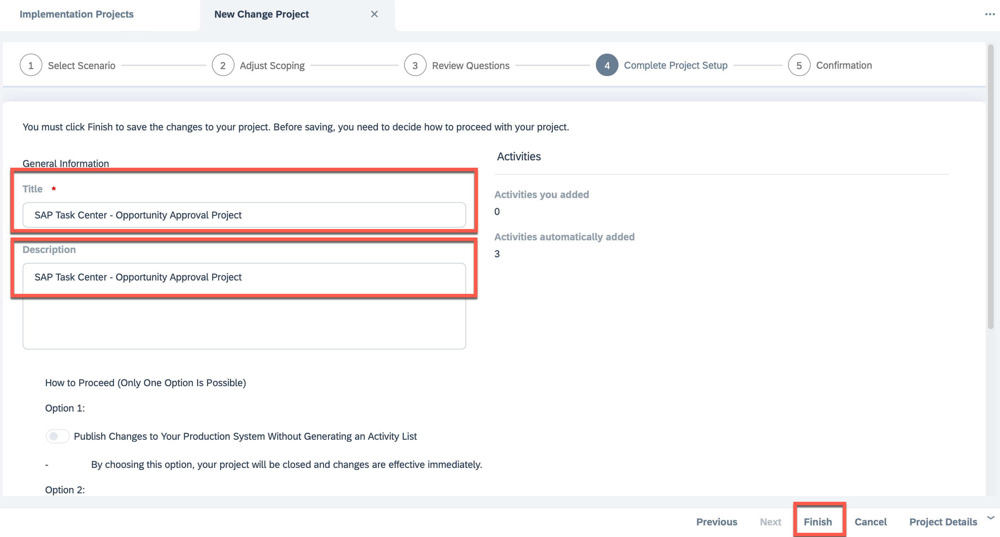
      
      
2. **Enable Submit for Approval for Custom Status**

    * Login to **SAP Cloud for Customer** with your **UserID**.
    
    * Go to **Business Configuration** → **Overview**.
    
    * Search for  Activity **'Opportunities'** and click on it to open it.
    
    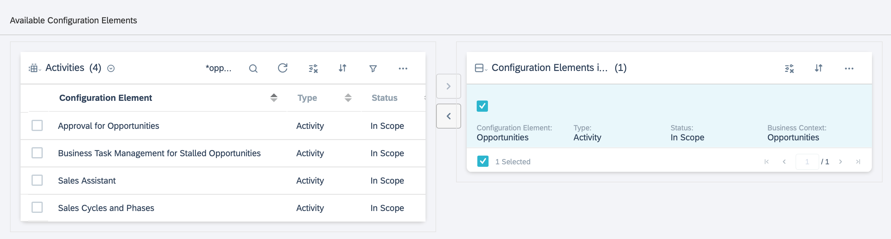
    
    * In the displayed factsheet click on the link **'Maintain Custom Status'**.
    
    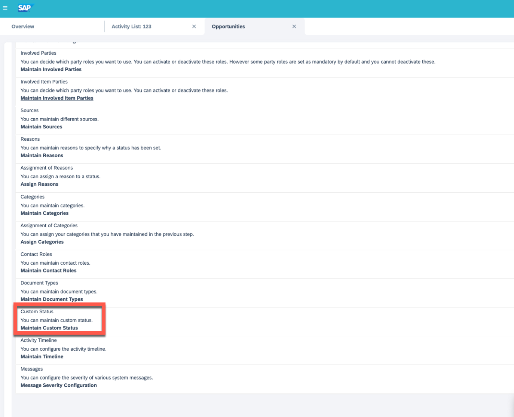
    
    * Select the document type **OPPT** in the header table **'Available Document Types'**.
    
    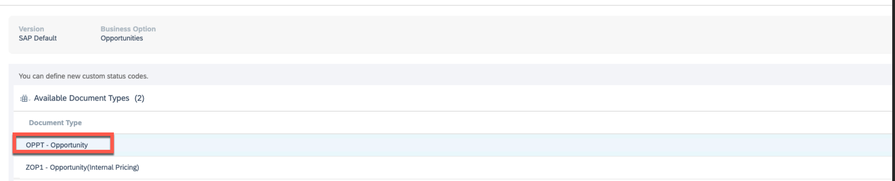
    
    * For Life Cycle Status entry **'2 - In process'**, select the checkbox **'Submit for Approval'**.
   
    * **Save**.

3. **Define Approval Process**

    * Login to **SAP Cloud for Customer** with your **UserID**.
    
    * From **Administrator** → **Approval Processes**, define an approval Process for Opportunity with either **'Reporting Line Manager'** or **'Direct Approver'** as work distribution. Here as an example, we setup a process where an Opportunity identified restricted to a specific AccountID must be sent for approval to the manager.
    
    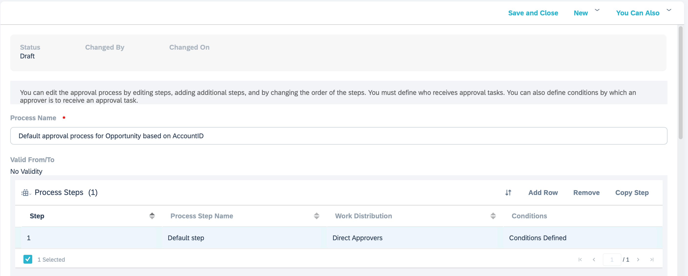
    
    
    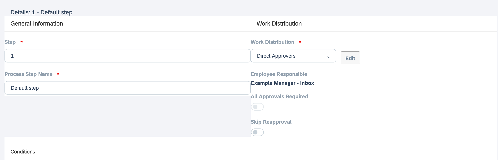
    
    
    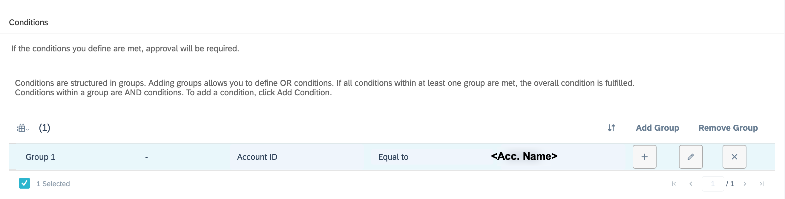
    
    

**Task Creation and Approval**

1. **Create a Task**

    * Login to **SAP Cloud for Customer** with your **UserID**
    * From **Sales → Opportunities**, create a new Opportunity by entering the following details:
         •	**Name**: Any string with AccountID **Account Name**
         •	**Account**: Enter **Account Name**.
    
      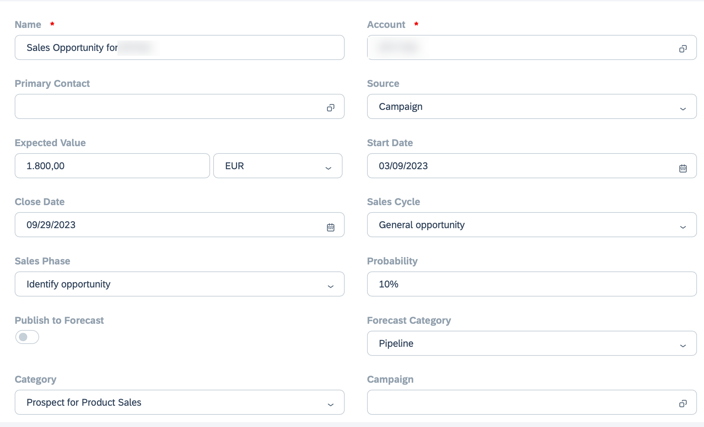
      
      
      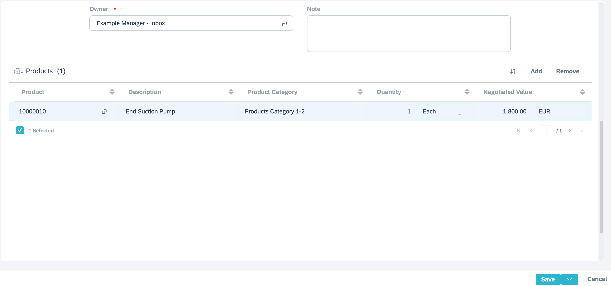
      
      
    * When you choose **Save**, a new approval task will be created for the reporting line manager of the user creating the task. 
   
    * The current approver can be confirmed by opening the Opportunity detail screen and navigating to the tab **Approval**.

      
      
2. **Approving the task**

    * Manager logs in with his credentials to SAP Task Center
    * The managaer finds the task and chooses **Approve** to approve the task, or chooses **Open Task** to open the task in SAP Cloud for Customer.
    
    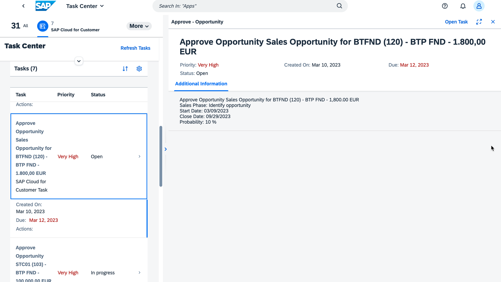
    
    
    * Choose the Bell icon on the top right of shell to see all notifications for recently assigned approval tasks.
    * Choose **Approve** to approve the task.
    
    
    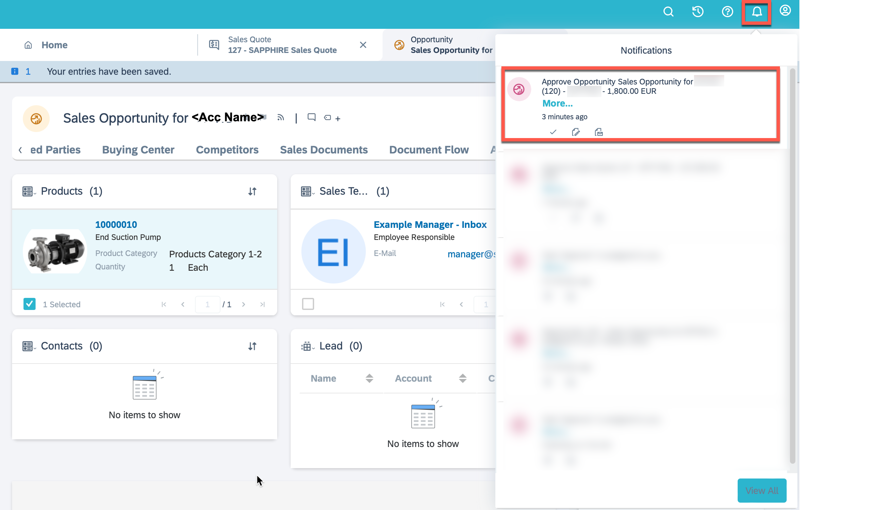
    
    
    
