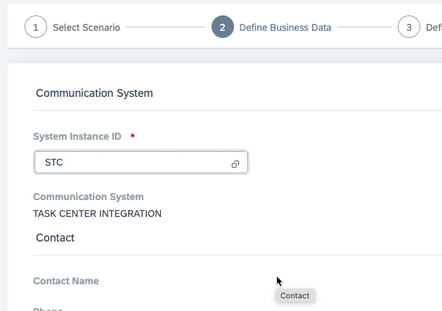
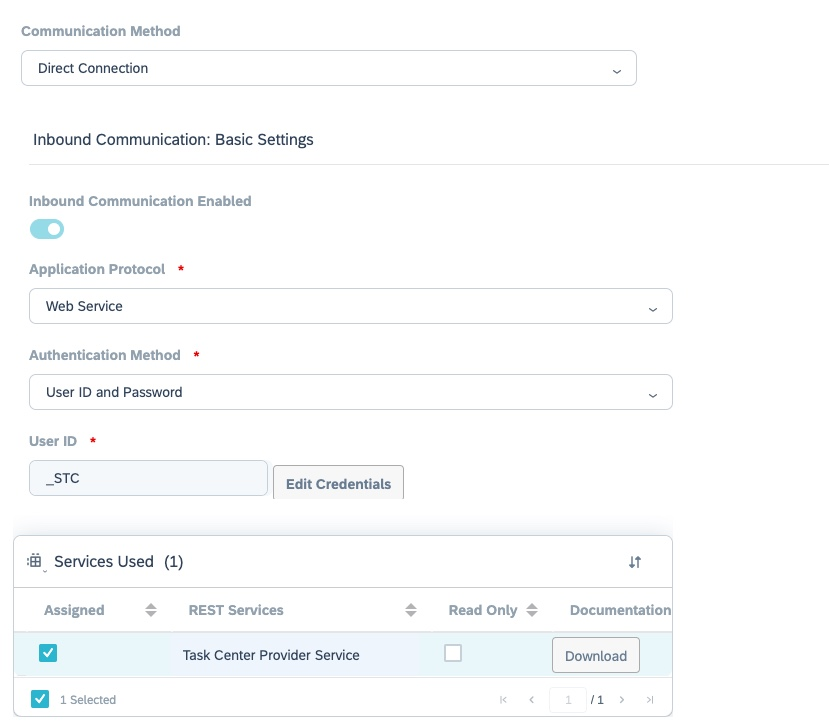

## Create Communication Arrangement SAP Cloud for Customer

1.	Navigate to **Administrator > General Settings > Integration > Communication Arrangements**.

2.	Choose **New** to create a new communication arrangement.

3.	Choose **Rest Services** as the communication scenario and choose **Next**.

4.	Under **Communication System**, enter the **System Instance ID** of the communication system with which you want to set up communication arrangements and choose **Next**.

5.	In the next step, select the communication scenarios for which you want to create the communication arrangements. 
In the **Inbound Communication: Basic Settings** section, check the details on the **Inbound tab** as follows:

  •	Inbound Communication Enabled: If you do not want to use a service, uncheck the checkbox. If the service is mandatory, the checkbox is disabled.

  •	Application Protocol: Make sure that the protocol is **Web Service**.

  •	Select the **Authentication Method** – **UserID and Password**. 

  •	In the **User ID** field, choose **Edit Credentials**.

  The user ID of the communication user is created automatically. Provide a **password** and select **SAP Task Center Provider Service**.

Note down the **user ID**, the provided **password**, and the **URL** of your SAP Cloud for Customer tenant . These details are required while creating primary destination with the technical user.

6.	Choose **Next** and review all the configuration details:

7.	On the next screen, when the communication arrangement has been created successfully, a success message is shown.

