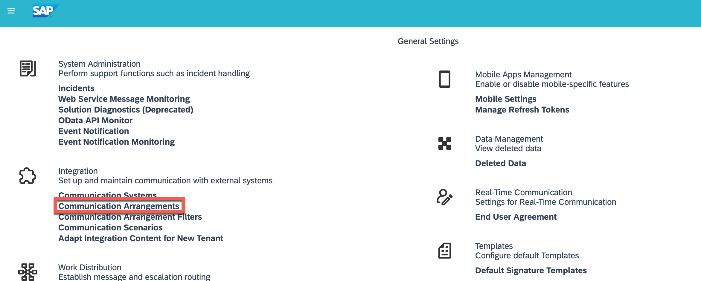
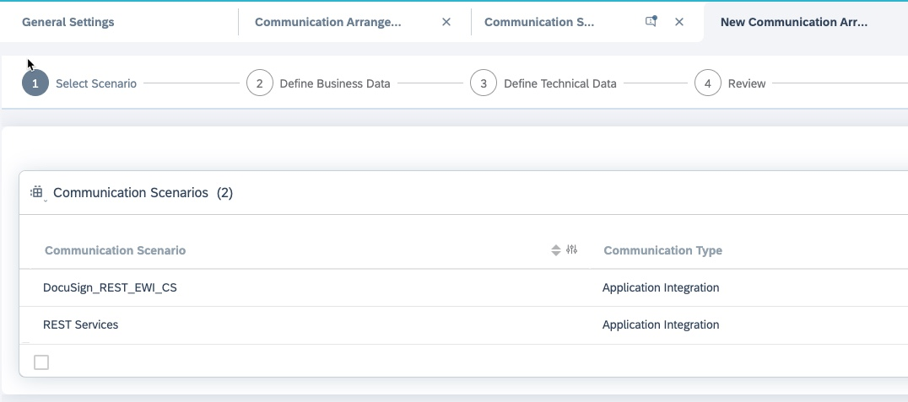
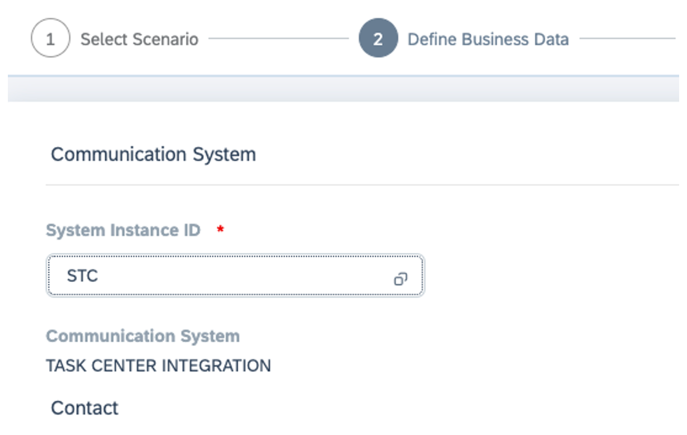
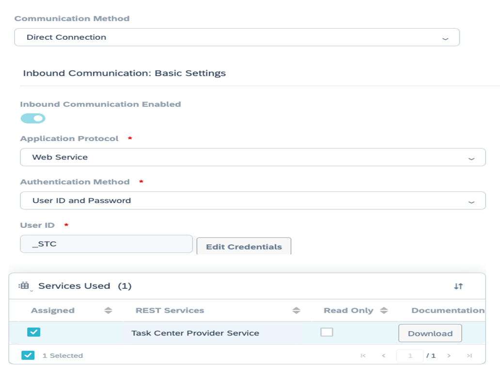
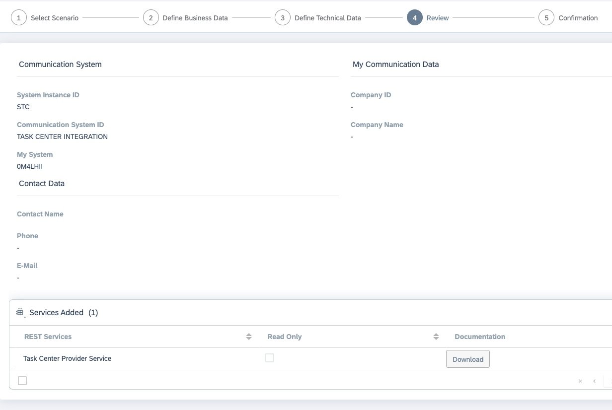
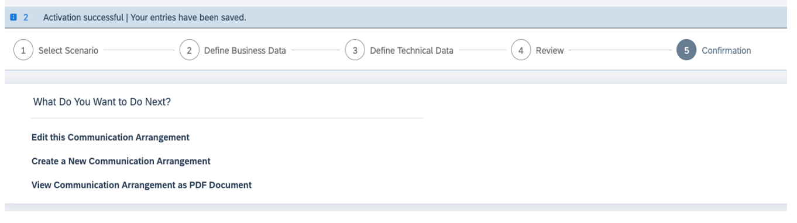

## Create Communication Arrangement C4C

1.	Navigate to **Administrator > General Settings > Integration > Communication Arrangements**.

2.	Select **New** to create a new communication arrangement.

3.	Select **Rest Services** as the communication scenario and click **Next**.

4.	Under **Communication System**, enter the **System Instance ID** of the communication system with which you want to set up communication arrangements and click **Next**.

5.	In the next step, select the communication scenarios for which you want to create the communication arrangements. 
Under **Inbound Communication: Basic Settings:** Check the details on the **Inbound tab** as necessary:

Enabled: If you do not want to use a service, uncheck the checkbox. If the service is mandatory, the checkbox is disabled.

Application Protocol: Check if the protocol is Web Service.

Select the **Authentication Method** – UserID and Password. 
In the **User ID** field, click **Edit Credentials**.

The user ID of the communication user is created automatically. Provide a **password** and select **SAP Task Center Provider Service**.

Note down the **user ID**, the provided **password**, and the **URL** of your SAP Cloud for Customer tenant . These details are then required while creating primary destination with the technical user.

6.	Click on **next** and review all the configuration details:

7.	In the next screen, A success message is shown once the communication arrangement has been created successfully.

