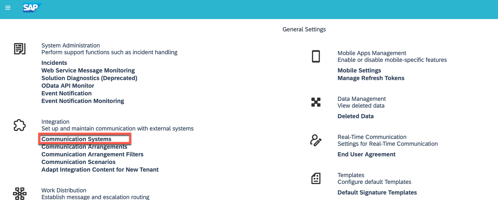
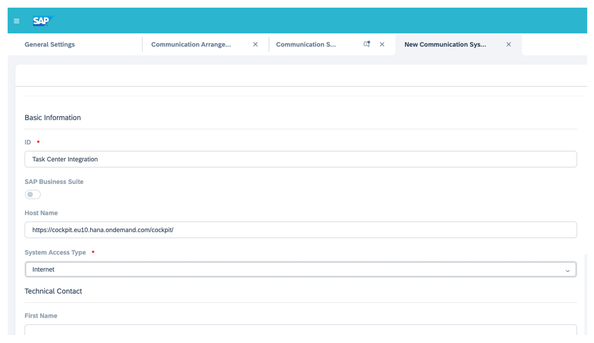
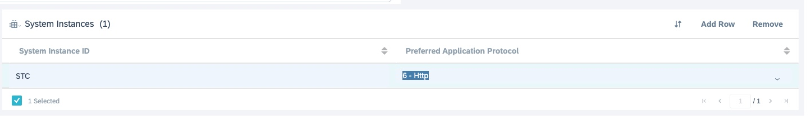
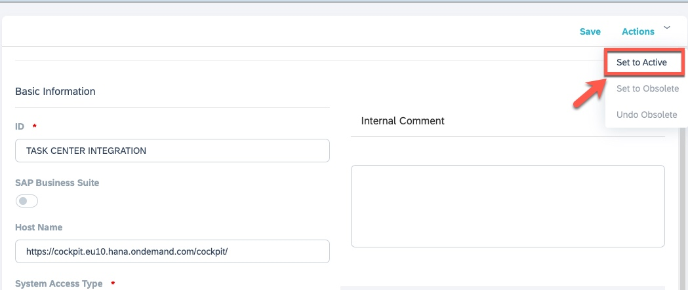

## Create Communication System C4C

1.	Navigate to **Administrator > General Settings > Integration > Communication Systems**. 
SAP Task Center is available using Free Tier, Cloud Platform Enterprise Agreement **CPEA** and Pay-As-You-Go. Please ensure that your SAP Business Technology Platform account belongs to one of these commercial models.

2.	Select **New** to create a new communication system.
On the **New Communication System** screen, in the **Basic Information** section, enter the following information.
**ID** - ID or name of the system to be connected
**Host Name**
Select **Internet** from the **System Access Type** dropdown.
New-Communication-System

3.	Select (**Add Row**) in the (**System Instances**) section
Enter a (**System Instance ID**) and Select (**6 - Http**) from the (**Preferred Application Protocol**) dropdown.

4.	Select (**Save**) and then select (**Set To Active**) from the (**Actions**) menu to activate the communication system.

