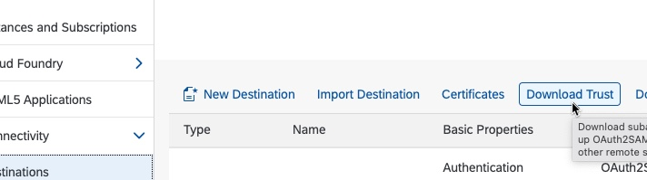
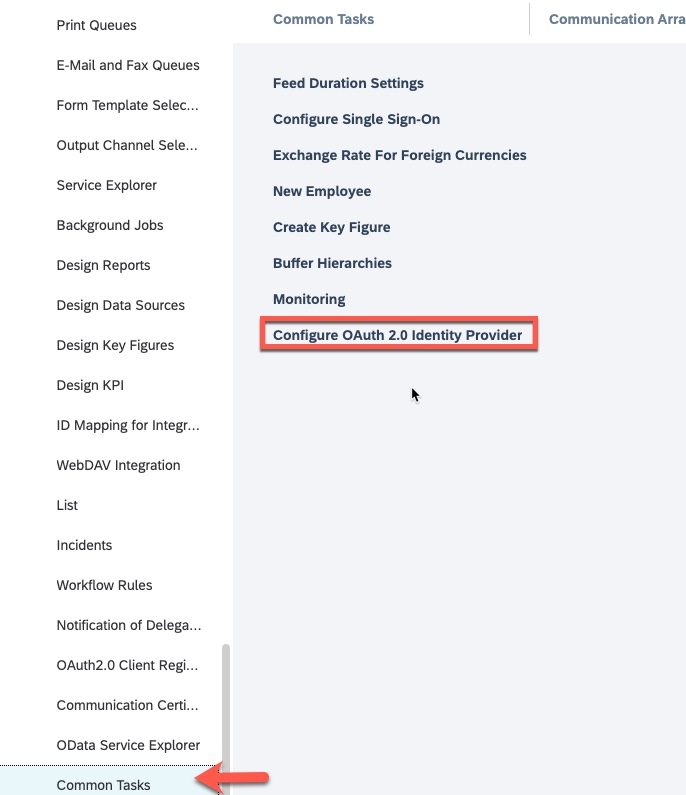
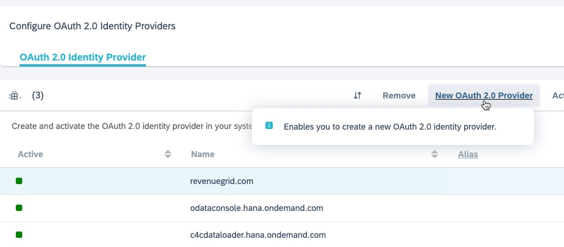
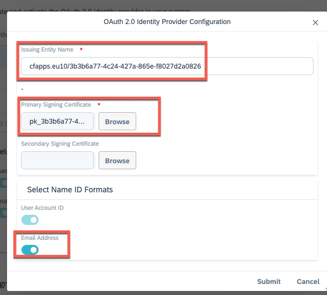
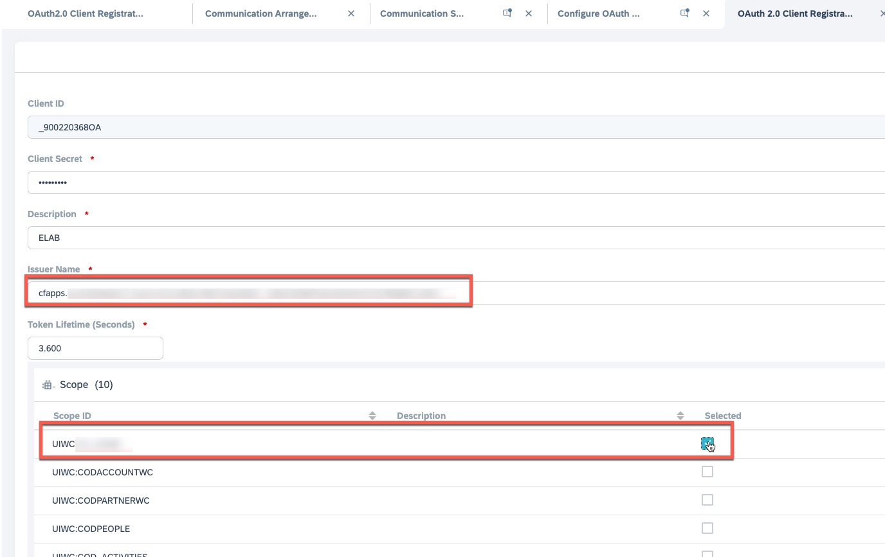

## Create a secondary SAP Cloud for Customer destination for the principal propagation

**Principal Propagation Flow and Set Up**

**Step 1: Configure SAP Business Technology Platform as OAuth Identity Provider in Cloud for Customer**

1.	In the SAP Business Technology Platform cockpit, choose your **Global Account** and your subaccount name from the **Subaccount** menu in the breadcrumbs.

2.	Navigate to **Connectivity > Destinations**.

3.	Select **Download Trust** to download the primary signing certificate of the subaccount.

4.	Open the downloaded file in a text editor, copy the certificate content (everything between —–BEGIN CERTIFICATE—– and —–END CERTIFICATE—–) to a new file, and save the new file.

5. In SAP Cloud for Customer, navigate to **Administrator > Common Tasks > Configure OAuth 2.0 Identity Provider**.

6. Select **New OAuth 2.0 Provider**.

7.	Enter a name in the **Issuing Entity Name** field in this format: **cfapps.<region_host>/(subaccountID)**
  
8.	Browse and upload the primary signing certificate.

9.	Enable **Email Address** in addition to **User Account ID** under **Select Name ID Formats**.

10.	Click **Submit**.
  

**Step 2: Register OAuth Client in SAP Cloud for Customer**

Register a new OAuth 2.0 client in SAP Cloud for Customer to get the Client ID and Client Secret

1.	Navigate to **Administrator >  OAuth 2.0 Client Registration**.
2.	Click **New**.
3.	Enter a **Client Secret** and **Description**.
4.	Select the OAuth 2.0 configured in the previous step from the **Issuer Name** dropdown.
5.	Select **UIWC:CC_HOME** from the scope list. 
6.	Save your changes.

You can note down the Client ID and the Client Secret for future reference.

**Step 3: Obtain Local Service Provider Value**

You must obtain the local service provider value and use it in the Audience field while creating a destination. 

1.	Navigate to **Administrator > Common Tasks > Configure Single Sign-On**.

2.	Copy the value in the Local Service Provider field.

Use this value in the **Audience** field along with the **Client Secret** and **Client ID** obtained previously to create a destination to create a secondary destination for the principal propagation. 

**Step 4: Create a secondary SAP Cloud for Customer destination for the principal propagation**.

1.	Navigate to the Cloud Foundry subaccount, where your SAP Task Center instance was created, and select **Connectivity > Destinations** from the navigation area on the left.

2.	Create a new destination and manually add the properties as described below.

**Optional**: Check this [link](https://help.sap.com/docs/TASK_CENTER/08cbda59b4954e93abb2ec85f1db399d/2cc8cee1c8fc44888eade975fb8b2284.html) to read complete details about each property defined above.

3.	Select the **Use default JDK truststore** checkbox.

4.	Choose **Save**.

