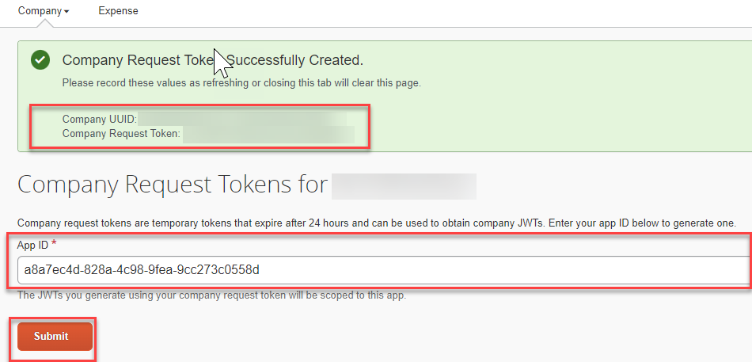

# Activate SAP Task Center Integration in SAP Concur

To complete the SAP Task Center and Concur integration, follow the guide, [Shared: SAP Task Center Integration with Concur Solutions](<https://www.concurtraining.com/customers/tech_pubs/Integration/Shr_SG_Task_Center_Integration.pdf>).

The guide details the prerequisites and configuration steps needed. 

1.  Note that the SAP Concur Company Request Token required for SAP Concur and SAP Task Center integration is different from the one used for integration with SAP Cloud Identity Services - Identity Provisioning and the App ID specified in this guide is for SAP Task Center only.

2.  Save the values generated in SAP Concur for **Company UUID** and **Company Request Token**, which you will later use for the configuration of the *SAP Task Center* destination in Business Technology Platform(BTP).
