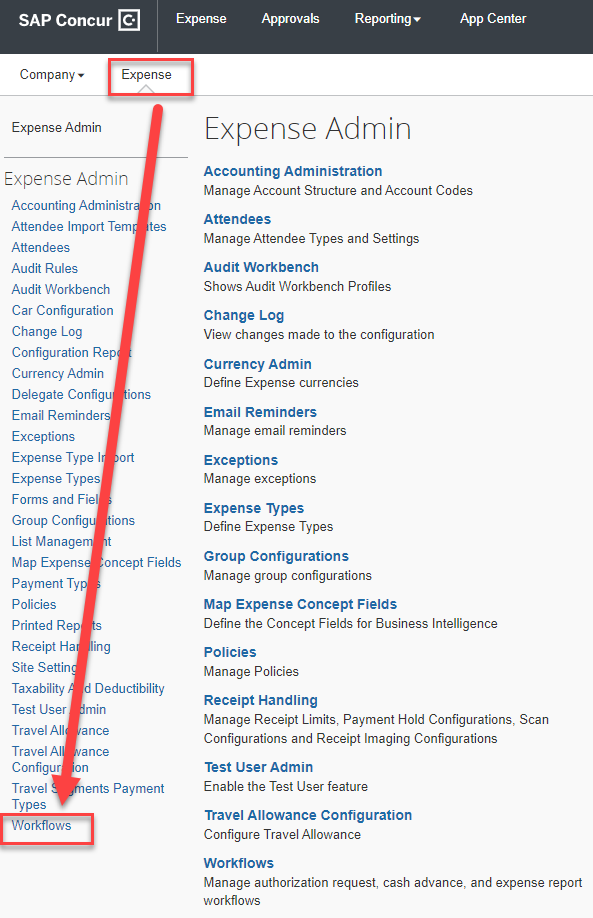
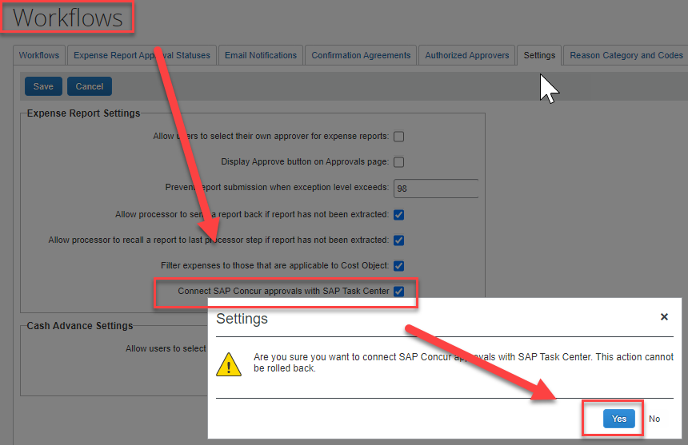

# Activate SAP Task Center Integration in SAP Concur

## Introduction

The integration supports approvers with the following user roles:

-   Approver

-   Authorized Approver

-   Cost Object Approver

-   Budget Approver

## Prerequisites

The administrator setting up the integration to SAP Task Center must
have the following permissions in SAP Concur:

-   Expense Configuration Administrator or Client Expense Administrator
    user roles to grant rights to view and modify Expense workflows.

-   Request Configuration Administrator, to grant rights to view and
    modify Request workflows.

-   Web Services Administrator user role, to grant rights to generate a
    company request token and company UUID.

For further details consult the Concur documentation here:
<https://www.concurtraining.com/customers/tech_pubs/Integration/Shr_SG_Task_Center_Integration.pdf>

## Workflow Configuration Expense

1.  Log into SAP Concur and open Administration \>\> Expense \>\>
    Workflows

2.  On the Settings tab, select the **Connect SAP Concur approvals with
    SAP Task Center**

check box. Confirm the prompt and click **Save**.

## Workflow Configuration Request

1.  Log into SAP Concur and open Administration \>\> Expense \>\>
    Workflows

2.  On the Settings tab, select the **Connect SAP Concur approvals with
    SAP Task Center**

check box. Confirm the prompt and click **Save**.

Note: The SAP Task Center integration is not reversable.

## Obtain Company Request Token for SAP Task Center

1.  Log on to SAP Concur with Web Services Administrator role.

2.  Open **Administration \>\> Company \>\> Authentication
    Administration \>\> Company Request Token**.

3.  Enter the following **Task Center App ID** into the **App ID**
    field: **a8a7ec4d-828a-4c98-9fea-9cc273c0558d** and click
    **Submit.**

4.  Retain the values of **Company UUID** & **Company Request Token**
    for configuration of the SAP Task Center destination.
