# Configure Single Sign-on in SAP Concur

## Introduction

In order to use SAP Task Center with SAP Concur we need to use SAP Cloud
Identity Services -- Identity Authentication (IAS) as an Identity
Provider to provide single sign-on to SAP Concur. To do this, we need to
establish trust between IAS and SAP Concur.

Consult the complete guide to Single Sign-On for SAP Concur here for
further information and more detailed steps, depending on your SAP
Concur Edition:

<https://www.concurtraining.com/customers/tech_pubs/Docs/_Current/SG_Shr/Shr_SG_SSO_Mgmt.pdf>

To establish trust between SAP Concur and IAS you will need to:

-   Get the SAP Concur metadata.

-   Create an Application on SAP IAS.

-   Change the Subject Name Identifier in SAP IAS.

-   Download the IDP metadata from SAP IAS.

-   Add IAS IdP metadata to SAP Concur.

## Get the SAP Concur Metadata

1.  Log on to your SAP Concur system, with administrative access to
    Authentication Admin.

2.  Go to **Administration \>\> Company \>\> Authentication Admin**.

3.  Click **Manage Single Sign-On**.

4.  Click the **Download** link under **Get SAP Concur Metadata**.

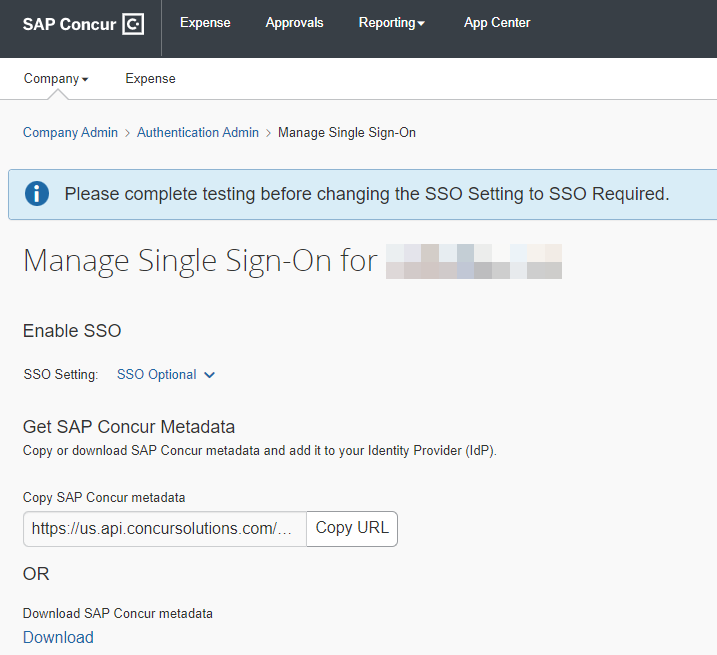

## Create an Application in SAP Cloud Identity Services -- Identity Authentication (IAS)

1.  Open the IAS Administration Console.

2.  Under **Applications**, click **Create**.

3.  Enter a **Display Name**, and for **Type**, select **SAP Concur
    Solution**. Click **Save**.

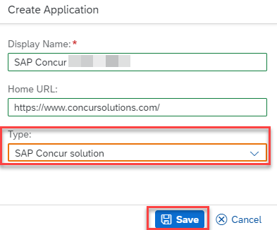

4.  Click **SAML 2.0 Configuration**.

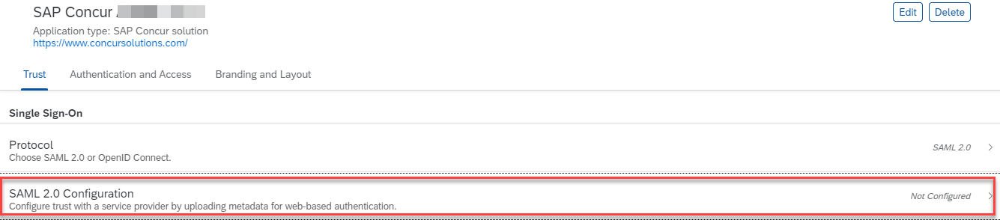

5.  Click the **Browse** button and locate your SAML 2.0 Metadata
    downloaded from SAP Concur.

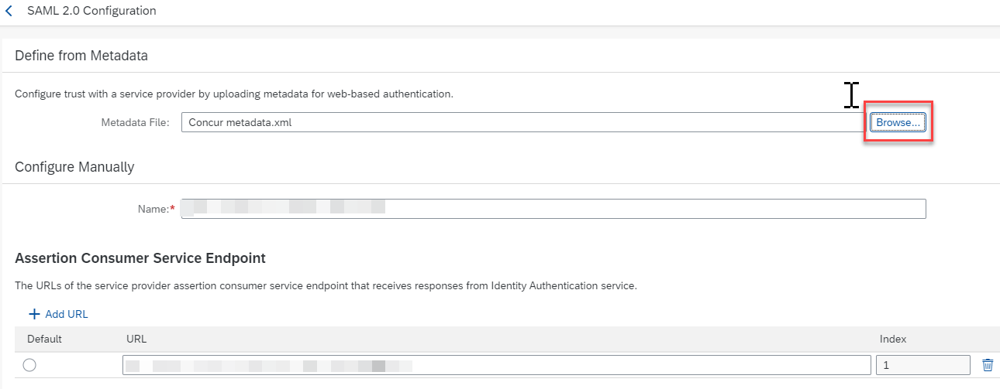

6.  Click **Save**.

## Change the Subject Name Identifier and Default Name ID Format in SAP Cloud Identity Services -- Identity Authentication (IAS)

1.  In the IAS Admin for your Application, click **Subject Name
    Identifier**.

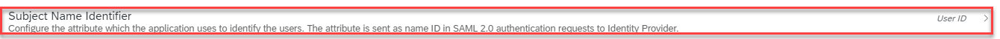

2.  Under **Basic Configuration**, select **Login Name** for a basic
    attribute. Click **Save**.

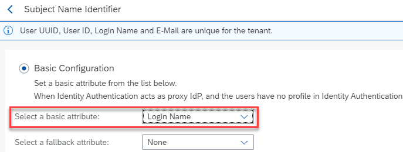

3.  Under **Default Name ID** **Format**, it is strongly recommended to
    select **Email Address**.

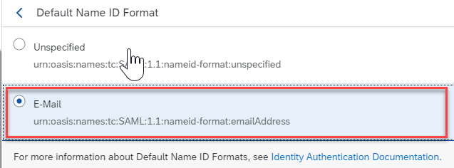

## Download the IDP metadata from IAS

1.  In your IAS Admin, go to **Applications & Resources \>\> Tenant
    Settings**.

2.  Click the **Download Metadata File** at the bottom of the page.

## Add IdP Metadata to SAP Concur

1.  In SAP Concur, go to **Administration \>\> Company \>\>
    Authentication Admin**.

2.  Click **Manage Single Sign-On**.

3.  Under **IdP Metadata**, click **Add**, enter a **Custom IdP Name**
    then select **Upload your IdP's metadata**.

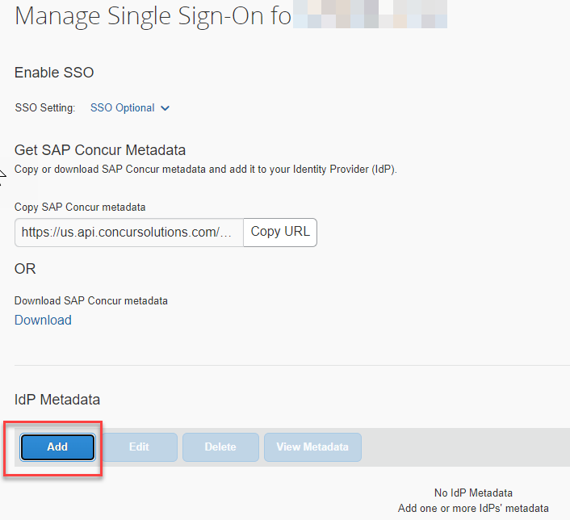

4.  Click U**pload XML File** and locate the metadata file you
    downloaded from your IAS tenant.

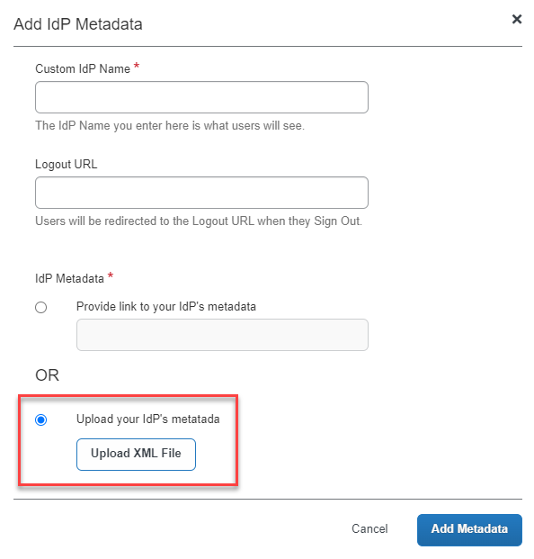

5.  Click **Add Metadata**.

6.  Until you have tested SSO using your new IdP configuration, it's
    advisable to test out your single sign-on first using the **SSO
    Optional** setting under **Enable SSO**.

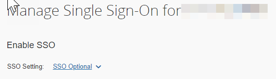

## Test Authentication using your IAS Tenant

1.  In a new private browser window, open the link to SAP Concur.

2.  Enter your **User Name** and click **Next**.

3.  You should have the option to choose the identity provider you
    added.

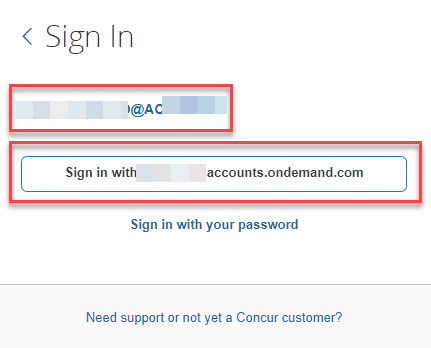

## Note

If you decide to use the SP-initiated flow (through SAP Concur's public
site: https://www.concursolutions.com/nui/signin), the Custom IdP Name
will display on the Sign In page right after a user provides their
Username and clicks Next. For example, if your Custom IdP in SAP Concur
is named \"SAP IAS\", then all users will see the option \"Sign in with
SAP IAS\" after entering their Email Address and clicking **Next**. This
does have an impact when opening tasks from SAP Task Center as you will
first need to enter your user name and then click the Sign in with SAP
IAS link when opening tasks in **SAP Concur** from the links in **SAP
Task Center**.
