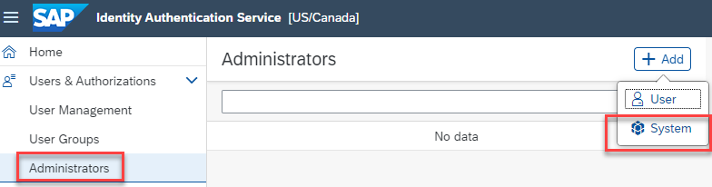
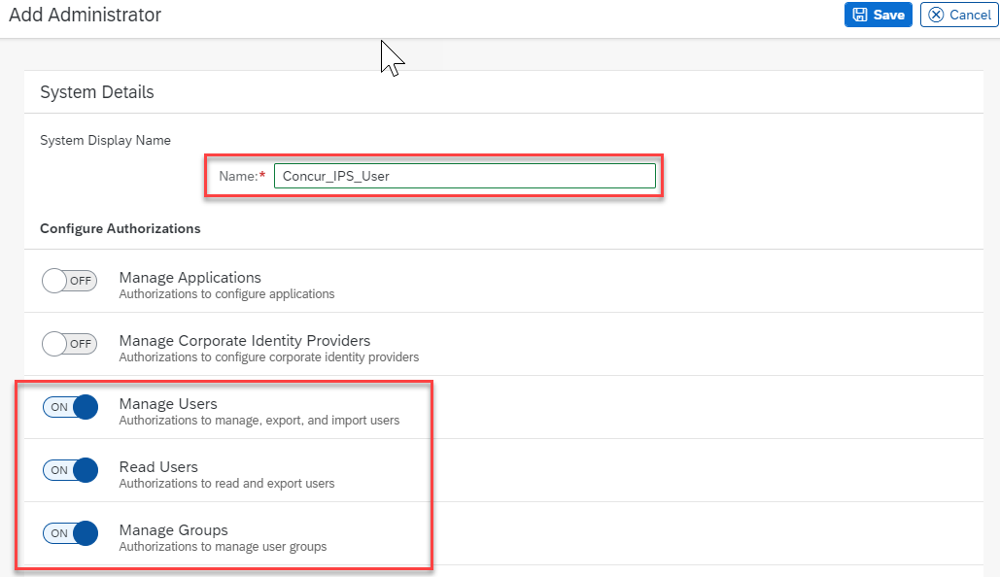
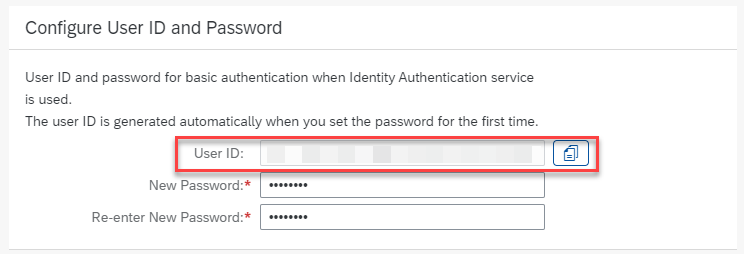
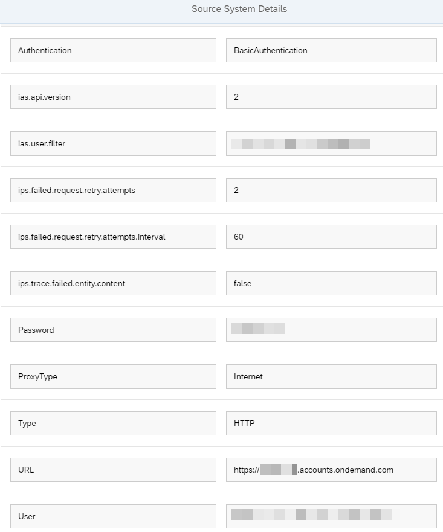
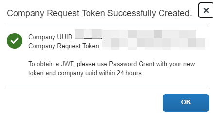
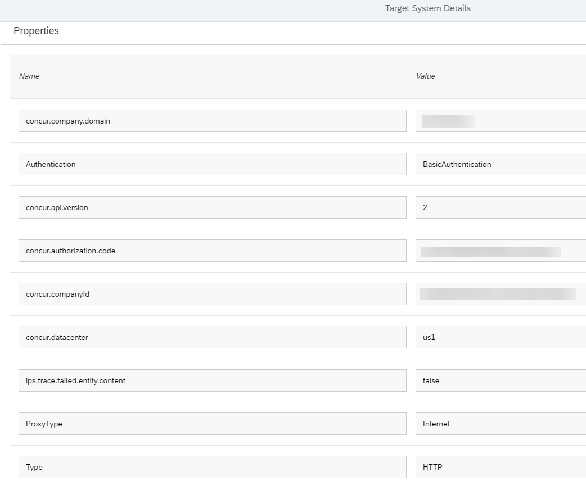

# Configure SAP Cloud Identity Services-Identity Provisioning Integration

## Introduction

In order to user SAP Task Center with SAP Concur we need to use SAP
Cloud Identity Services -- Identity Provisioning to Provision users from
Identity Authentication to SAP Concur/update users in SAP Concur with
the User UUID from IAS

To set up user provisioning to SAP Concur you need to:

-   Add a System User to IAS

-   Create a Source System IAS in IPS

-   Create Company Request Token in SAP Concur

-   Add Target System SAP Concur in IPS

-   Run the synchronisation job in IPS

## Add a System User to IAS

1.  In IAS admin, go to **Users & Authorizations \>\> Administrators**.

2.  Click **Add**, select **System.**

3.  Enter a name and make sure you enable **Manage Users, Read Users and
    Manage Groups** under Authorizations. Click **Save**.

4.  Click Set Password.

5.  Enter and confirm your new system user's password and click
    **Save**.

6.  Click on the **Set Password** link again and copy the generated
    **User ID** attribute.

## Create Source System IAS in IPS

1.  Open your IPS Admin Cockpit and under Source Systems, click Add.

2.  Enter a **System Name** and select **Identity Authentication** as
    the **Type**.

3.  Click the **Properties** icon to open the properties tab and click
    **Edit**.

4.  Leave the defaulted properties as they are and add the add the
    following properties:

-   **Authentication**: BasicAuthentication

-   **ias.user.filter**: username eq \"DEMO\" (optional)

-   **ias.group.filter**:  displayName eq \"BR_DEMO\" (optional)

-   **ips.trace.failed.entity.content**: false

-   **Password**: \<Password for System User\>

-   **ProxyType**: Internet

-   **Type**: HTTP

-   **URL**:  \<IAS Tenant URL\>

-   **User**:  \<System User\>

5.  Click **Save**.

6.  Your configured properties should look something like the screenshot
    below. Note that I have used a filter to just provision a test
    user. You will need to add or adapt user and group filters to suit
    your needs.

## Create Company Request Token in SAP Concur

1.  Follow the steps in the [SAP Concur Documentation, Shared: Configure an
SAP Concur Entity as an
IdP Target](https://www.concurtraining.com/customers/tech_pubs/Docs/_Current/SG_Shr/Shr_SG_Concur_IdP_Target.pdf) to generate an SAP Concur company request token for SAP Cloud Idenitty Services - Identity Provisioning (IPS).

2.  Save the values generated in SAP Concur for **Company UUID** and **Company Request Token**, which you will later use for the *SAP Concur* target system configuration in the IPS admin console.

> 

3.  **Note: **The token must be entered into the IPS connector
    configuration within 24 hours. Otherwise, it will expire, and
    you\'ll have to request a new token.

## Create Target System SAP Concur in IPS

1.  In your IPS admin cockpit, open **Target Systems** and click
    **Add**.

2.  Under **Details**, select **SAP Concur** for **Type** and enter a
    **System Name**.

3.  In the **Source Systems** field, select the source system (Identity
    Authentication) you defined. Click **Save**.

4.  Open **Properties** and click **Edit**.

5.  Add the following properties and leave the existing pre-generated
    properties unchanged:

    -   **Type**: HTTP

    -   **ProxyType**: Internet

    -   **Authentication**: BasicAuthentication

    -   **concur.datacenter**: \<Your SAP Concur Datacenter\> eg us1

    -   **concur.companyId**: \<Your Concur Company UUID\> (obtained when
        generating Company Request Token in SAP Concur)

    -   **concur.authorization.code**: \<Token obtained when generating
        Company Request Token in SAP Concur)

    -   **concur.company.domain**: \<Your SAP Concur Company Domain\> (the
        portion after the @ symbol in your SAP Concur Logon Name).

6.  Click **Save**. Your target system properties should look something
    like the screenshot below.

7.  Leave the transformations unchanged.
   
8.  For further information on the IPS transformations for SAP Concur, refer to [SAP Cloud Identity Services - Identity Provisioning, Target Systems, SAP Concur](https://help.sap.com/docs/IDENTITY_PROVISIONING/f48e822d6d484fa5ade7dda78b64d9f5/032fd80fd7de4e4992402637b77c1f2c.html)

## Run the Provisioning Job

1.  Return to the **Source Systems** and open your source system and
    click the **Jobs** icon.

2.  For the Read Job, click **Run Now**.

3.  Review the results of your synchronisation under the **Job Logs**
    section.
