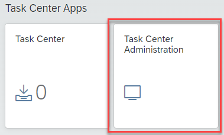
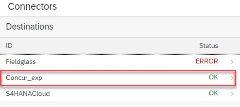
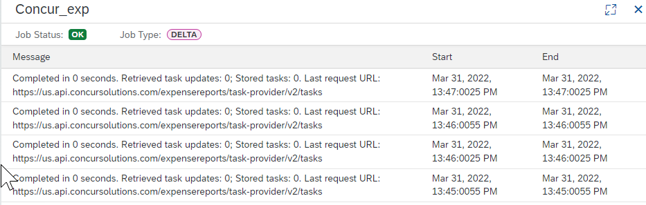
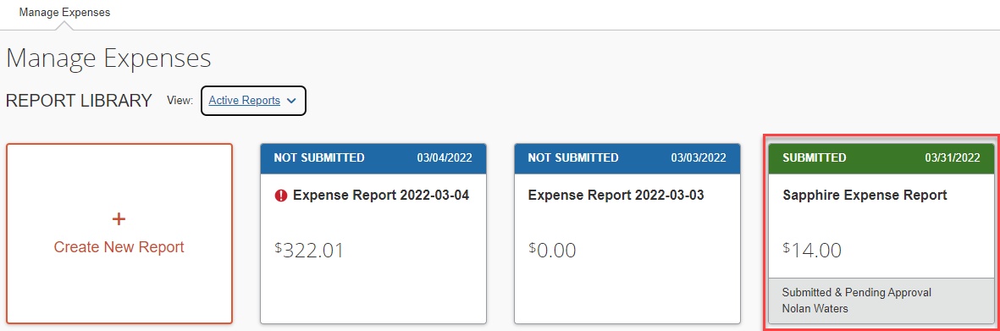
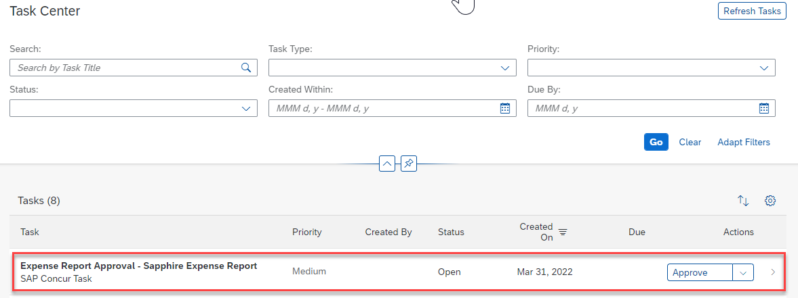
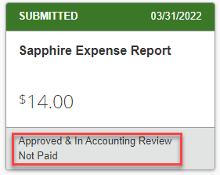

# Validate and Test Your Integration

## Check Task Center Connector to SAP Concur

1.  Log on to your Launchpad and open the **Task Center Administration**
    App under **Task Center Apps**.

2.  The general status of your Task Center destinations is displayed.

3.  Click on your Concur_exp or Concur_req destination and review the
    Jobs -- you can see the status for configuration, initial task
    retrieval, metadata retrieval and delta jobs.

4.  Click any of the Jobs to see the details of the job executions.

## Create an Expense in SAP Concur

1.  Open SAP Concur and click the **Expense** tab.

2.  Create a new expense report by clicking **Create New Report**. Enter
    the details and add an expense item then submit your expense report.

3.  Open SAP Task Center from your Launchpad. The submitted expense
    should appear in your tasks. Click **Approve** to approve the
    expense.

4.  Return to SAP Concur and confirm that the task is now in an approved
    status.

