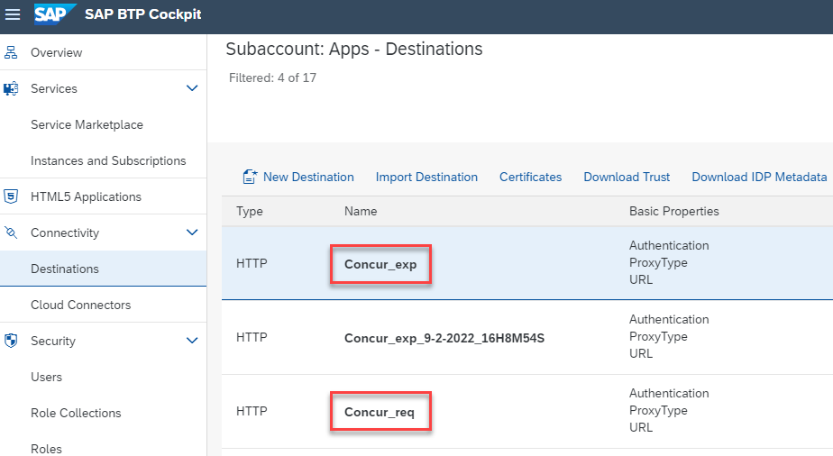
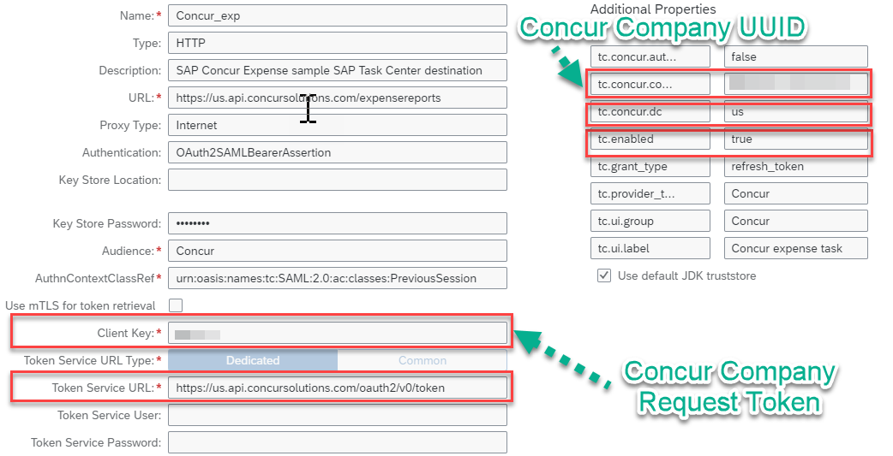

1. Access your BTP Subaccount.
2. Your SAP Concur may have Concur Expense, Concur Request, or both. SAP Task Center requires separate destinations for each product (Concur Expense and Concur Request). The URL specifies whether the destination is for Concur Expense or Concur Request. Each destination should have a unique combination of the fields URL and Client Key.
3. Under **Destinations**, select the **concur_exp** or **concur_req** destination that was created when you ran the booster to setup Task Center.
   

4. Edit the pre-created destination and update the properties below:
   * __URL__: <Your Concur Data Center API URL> for example https://us.api.concursolutions.com/expensereports
    (https://<datacenter_base_URI>/expensereports for Expense or https://<datacenter_base_URI>/travelrequest for Requests)
   * __Client Key__: <Company Request Token obtained in SAP Concur>
   * __Token Service URL__: <Your Concur Token Service URL> for example https://us.api.concursolutions.com/oauth2/v0/token (https://<datacenter_base_URI>/oauth2/v0/token)
   * __Token Service User__: <Company UUID Obtained in SAP Concur>
   * __Token Service Password__: <Company Request Token obtained in SAP Concur>
   * __Additional Properties__:
     * __tc.enabled__: true (this property is not added to the automatically created destinations, you will need to manually add it).
     * __tc.concur.companyUUID__: <Your Company UUID>
  (For Additional Properties, click __New Property__ and type property name and value.  Make sure ‘t’ is lowercase in “tc.enabled”).
     * __tc.concur.dc__: <Your Concur DC> for example us (valid ones are eu&us)
  
5. Confirm that your setup looks similar to the one in the screenshot and __Save__ your configuration.

