1. Download the **SAML 2.0 metadata** file from the Administration Console of Identity Authentication service or using the URL https://<Identity_Authentication_tenant>.accounts.ondemand.com/saml2/metadata  

2. Go to SAP Fieldglass and choose the **Configuration Manager** user.  
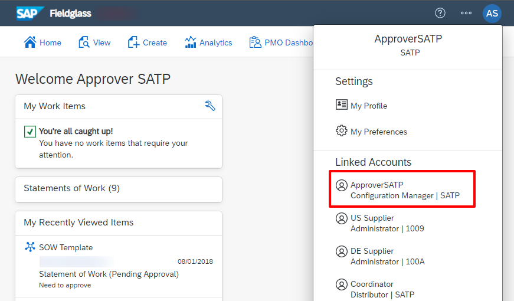
3. Click on **View Single Sign-On** Tile.  

4. On the Single Sign-On Setup page, choose **Edit**.  

5. In the **Identity Provider Details** section, choose the **Upload** button to upload the client's metadata file using the **Identity Provider Metadata Import** tool.  
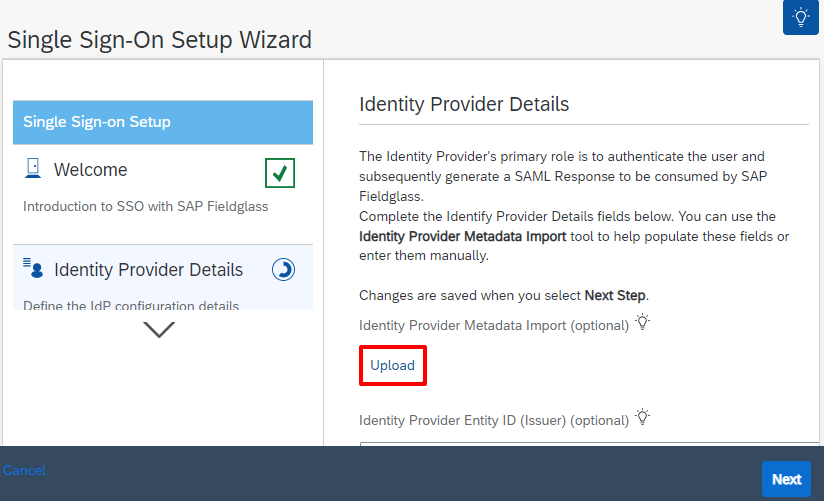

6. In the **SAML Identity Location** property, choose **Attribute**, and in the **Attribute Name** text box, type sap_uid, click **Next**.  
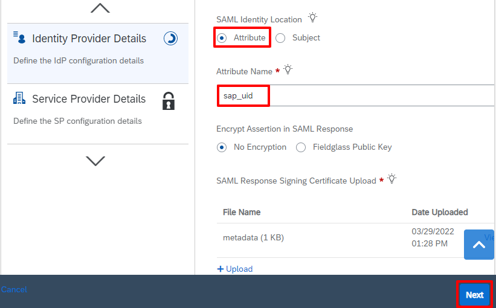
7. In the **Service Provider Details** section, choose **Yes** for the **Enable Deep Linking In Notifications?** property, click **Next**.  

8. The **Finished** step opens, confirming you have finished SSO setup, click **Exit Wizard**.  

9. Click on **Actions -> Download SP Metadata**.  
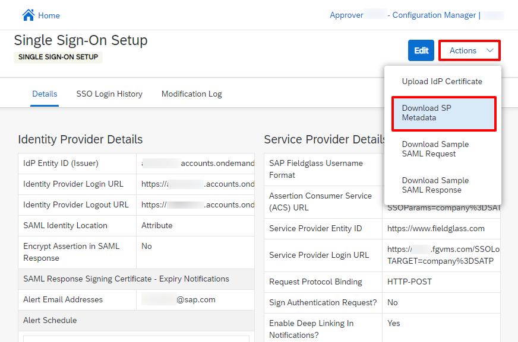
10. Go to your Identity Authentication Service Admin Console. Create a new application under **Applications**.   
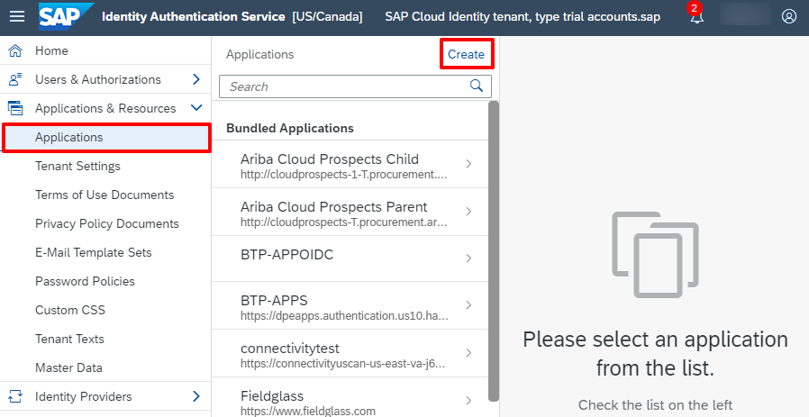
11. Enter a **Name** of your Fieldglass tenant, and choose **SAP Fieldglass solution** as the type of your application.  
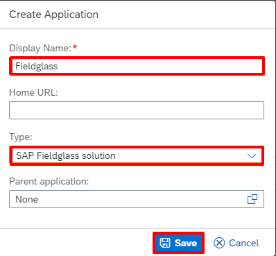
12. Click on **SAML 2.0 Configuration**.
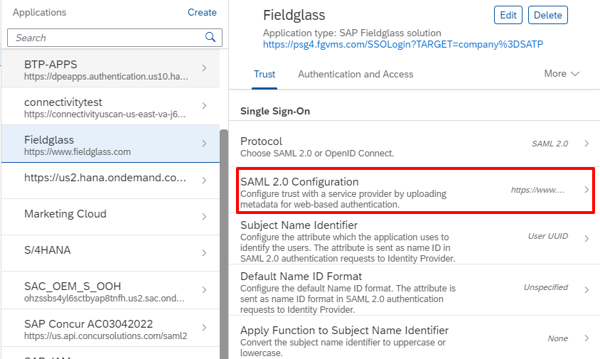
13. Click on **Browse** to upload the Fieldglass metadata. 
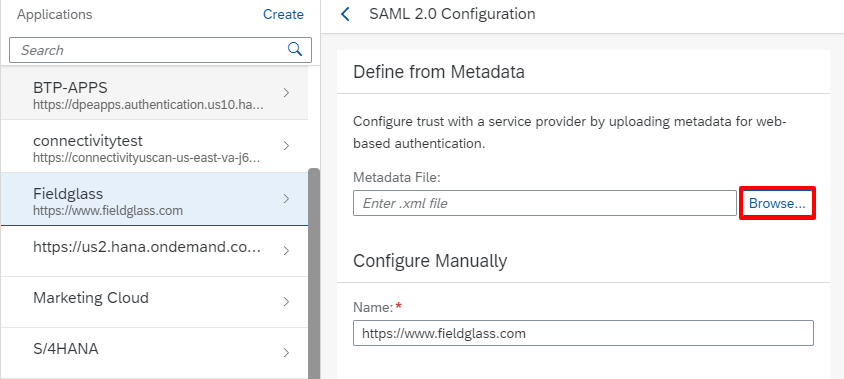
14. **Save** the configuration.  
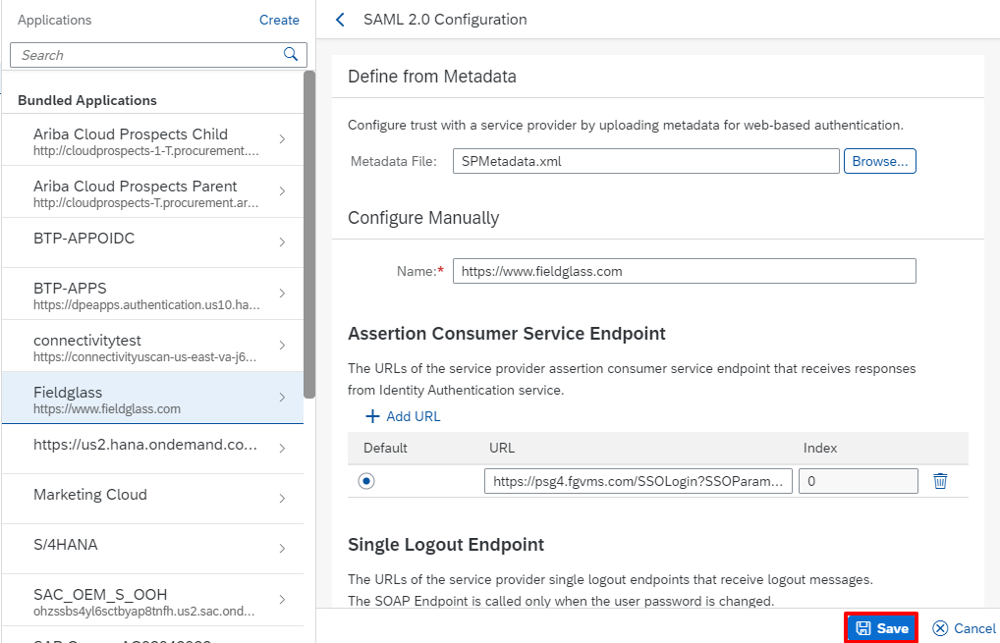
15. Click on **Subject Name Identifier**.  
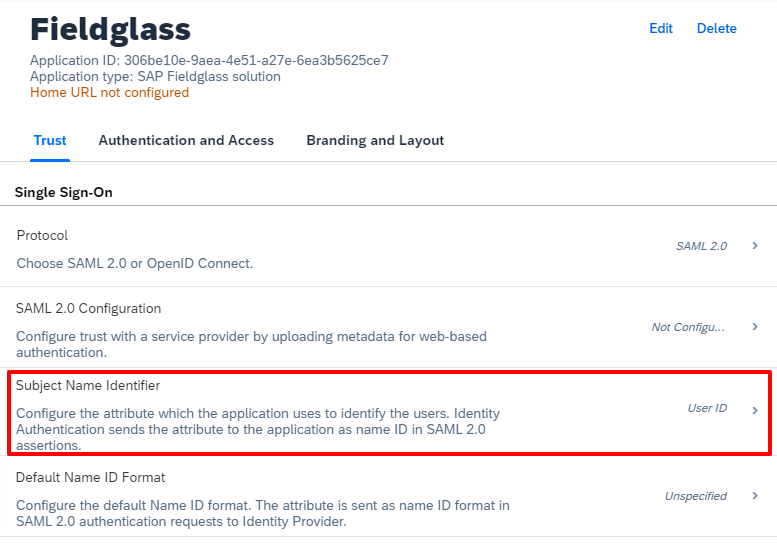
16. Select **User UUID** as a basic attribute and **Save**.
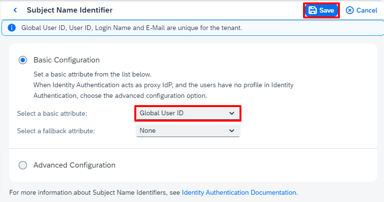
17. Click on **Assertion Attributes**.
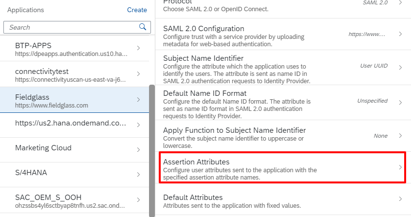
18. Add/Modify **User UUID** mapping to **sap_uid** and **Save**.

19. Contact SAP Fieldglass Customer Support at https://www.fieldglass.com/customer-support. Information published on non-SAP site to request assistance with enabling the custom script sso.sapid2uname for the company. 

