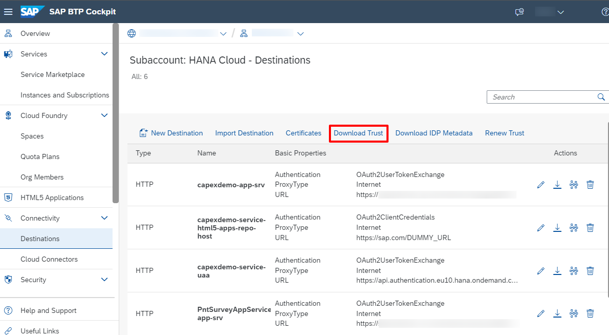

After enabling SAP Task Center in SAP Fieldglass, follow this procedure to establish trust with the SAP Destination service.

## Procedure

1. To export your trust certificate in the SAP BTP cockpit where your SAP Task Center instance was created, navigate to your Cloud Foundry subaccount and then select **Connectivity Destinations** from the navigation area on the left.
2. Select **Download Trust**.  
  
 
>**Note**  
>Make sure to renew your trust certificate before it expires. For the time while you are renewing the trust certificate and updating it for SAP Fieldglass, you may not be able to work on tasks, nor receive task updates. For more information, see [Renew Destination Trust Certificates](https://help.sap.com/viewer/08cbda59b4954e93abb2ec85f1db399d/Cloud/en-US/8080abf7d2cf4918802aa86e955ffc8b.html).
 
3. Save the trust certificate file locally with extension _.cer_.
4. Contact your SAP Fieldglass representative to upload this certificate in the SAP Fieldglass tenant Truststore.

>**Note**  
>Check out the [Supported Use Cases](https://help.sap.com/docs/SAP_FIELDGLASS_INTEGRATION/73c0a1be6aaa46ef9b66b1c3f28a77f4/3c8f268a82ff46f2a8b2ddde9071407c.html).
