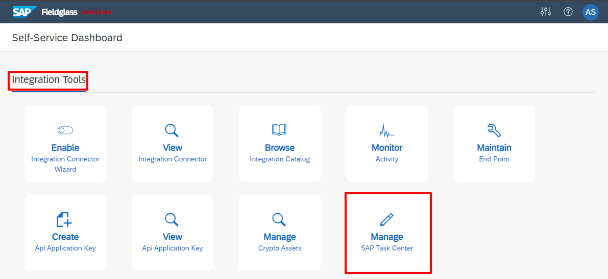
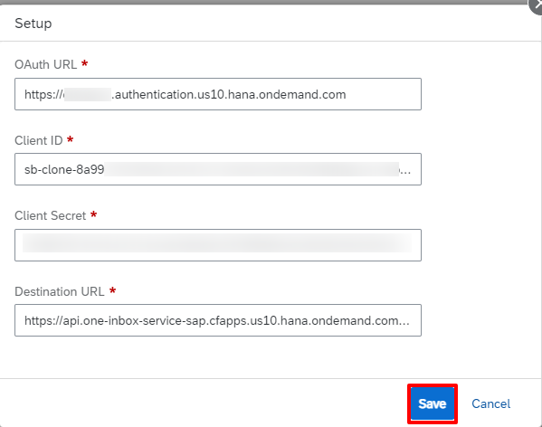
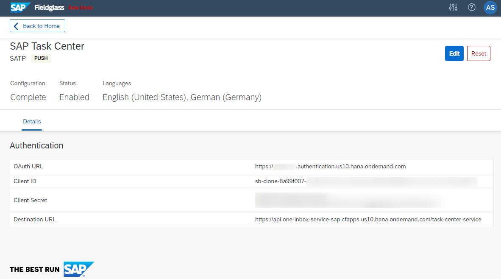

To enable task updates to be pushed from SAP Fieldglass to SAP Task Center, you need to set up the authentication credentials from SAP BTP cockpit where your SAP Task Center instance was created.
>**Note**  
>In this step, you get the service key that contains the values required for the Integration Service Registration Center.

## Prerequisites
You've contacted SAP Fieldglass support to have `SAP_TASK_PUSH_CAPABILITY` in CompanySysEnvtable enabled and system cache refreshed for the company. This avoids a processing error when you go to set up SAP Task Center.

## Procedure
1. Sign into Configuration Manager and under **Integration Tools**, choose **Manage SAP Task Center**. The SAP Task Center page opens.  
   
>**Note**
>If you get an error stating the push capability is disabled, refer to the first Prerequisites for resolution. Once the capability is enabled and cache is refreshed, you can proceed.

2. Choose **Configure**. The **Setup** dialog box opens.  
3. In the **Setup** dialog box, enter the service key details you received when following the prerequisites for creating a new service instance.  
  * __OAuth URL__: Copy the `uaa > url` attribute value from the prerequisites section. For example, `https://ies-one-inbox.authentication.sap.hana.ondemand.com`.
  * __Client ID__: Copy the `uaa > clientid` attribute value from the prerequisites section.
  * __Client Secret__: Copy the `uaa > clientsecret` attribute value from the prerequisites section.
  * __Destination URL__: Copy the `endpoints > inbox_rest_url` attribute value from the prerequisites section. For example, `https://api.one-inbox-service-sap.cfapps.sap.hana.ondemand.com/task-center-service`.  
   
4. Choose **Save**. The values are saved in the **Authentication** section on the SAP Task Center page. The push capability in now enabled.  
 
