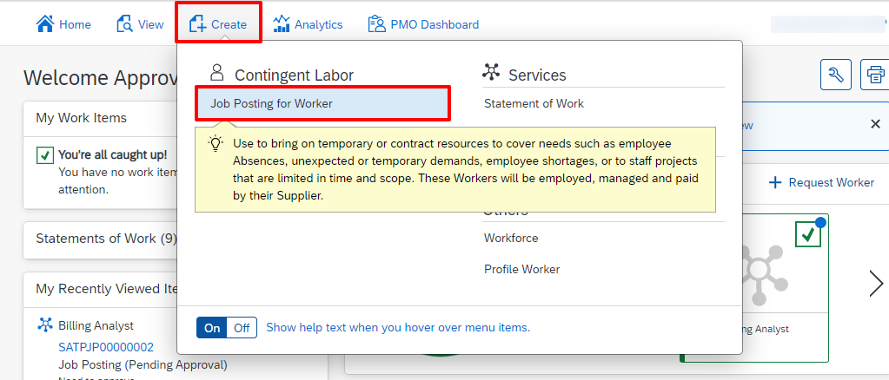

Test Task Center integration with the following steps.  
  
Log into SAP Fieldglass tenant as Hiring Manager and create an approval task. For example, you can create a job posting approval task in SAP Fieldglass.
1. Click on the **Create** button, and select **Job Posting for Worker** under **Contingent Labor**.

2. The Hiring Manager will select the Job Posting Template titled **Billing Analyst**.
