Test Task Center integration with the following steps.  
  
Log into SAP Fieldglass tenant as Hiring Manager and create an approval task. For example, you can create a job posting approval task in SAP Fieldglass.
1. Click on the **Create** button, and select **Job Posting for Worker** under **Contingent Labor**.  
  
2. The Hiring Manager will select the Job Posting Template titled **Billing Analyst**.  
  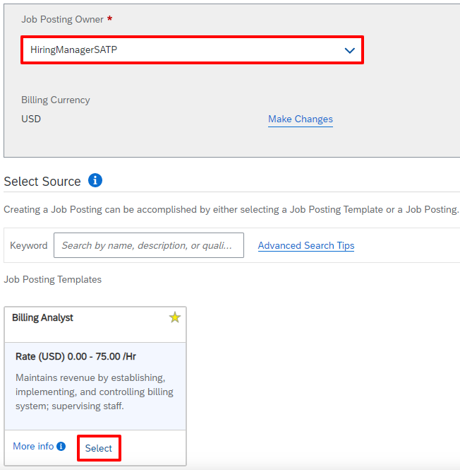
3. Enter a Start Date. This should be a date at least 2 weeks into the past from today’s date. This is required, in order to submit timesheet(s), which is later in this
script. Then, enter an End Date, which can be +3-6 months from now.  
  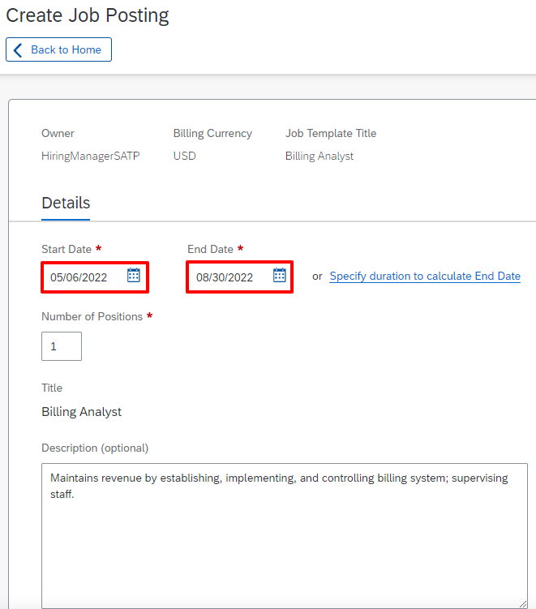
4. Scroll Down to enter further details:
   * __Is travel required for position?__: `No`
   * __Legal Entity__: `1710`
   * __Site__: `Plant 1 US (1070)`
   * __Business Unit__: `Purch. Org 1710 (1710)`  
  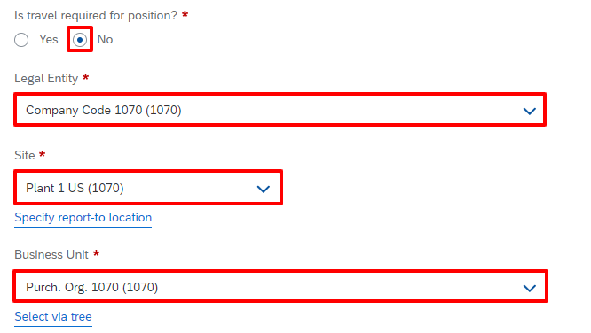
5. Add a **Cost Center** and select **General Ledger Account**, click on **Submit** button.  
  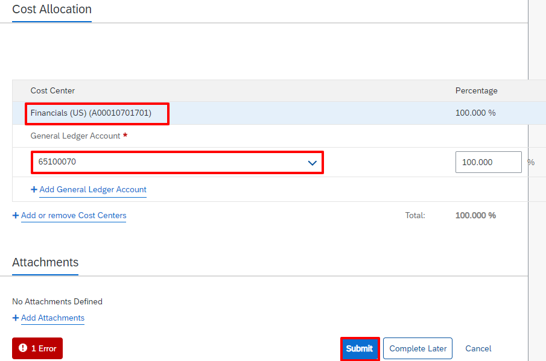
6. Job Posting is created.  
  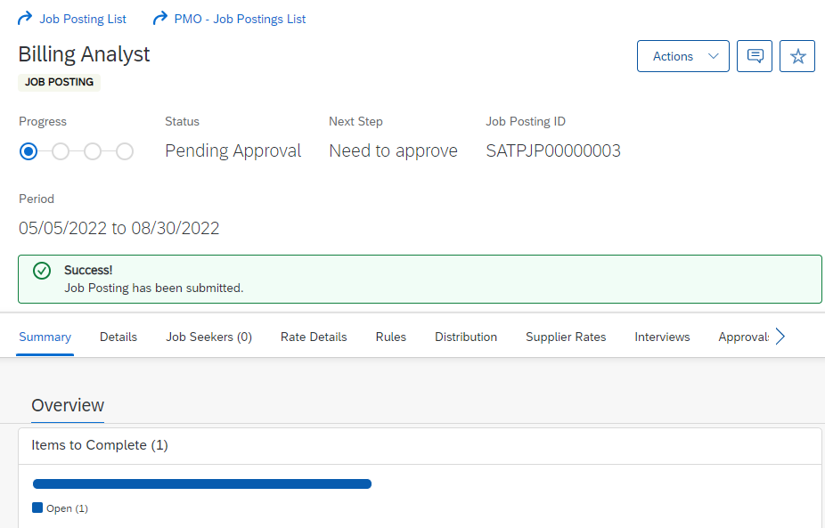
7. Login to **SAP Launchpad Service** with Approver user credentials.  
  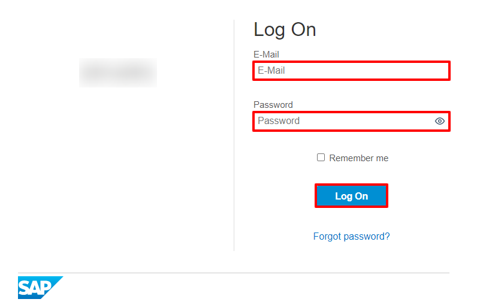
8. Open **SAP Task Center**.  
  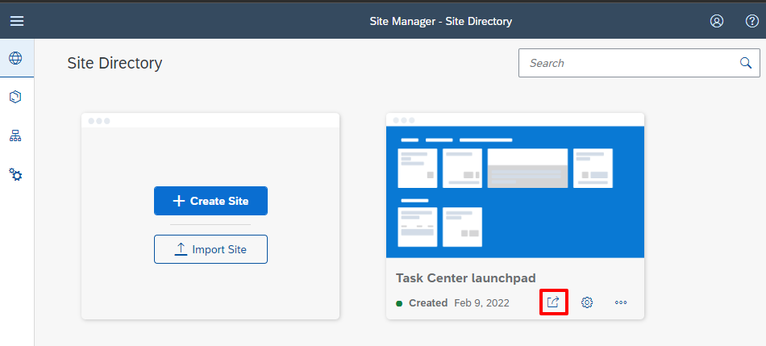
9. Click on **Task Center**.  
  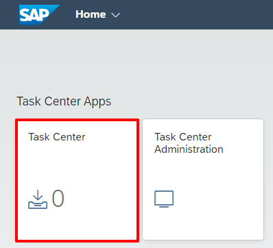
10. Approve/Reject **Job Postings** in your Tasks.  
  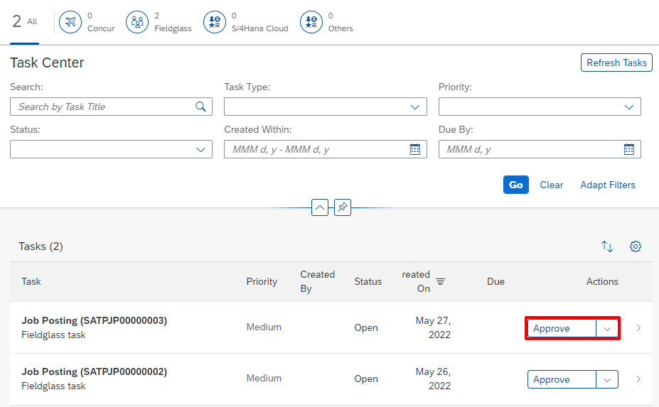
11. Enter a Decision Note and Click on **Sumbit** button.  
  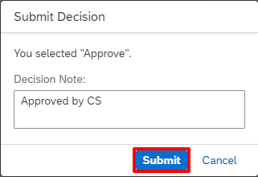
12. The task will disappear from the list, and return to SAP Fieldglass toconfirm that Job Posting is now in an approved status.  
  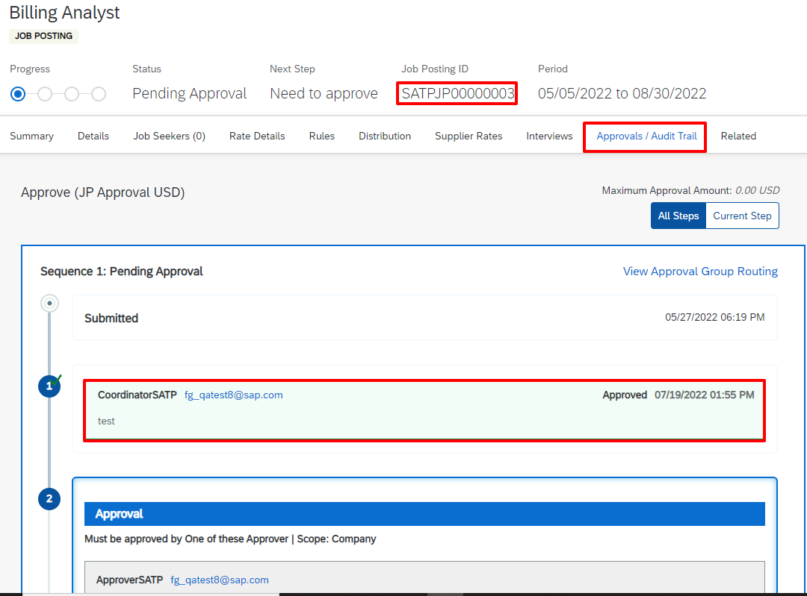
