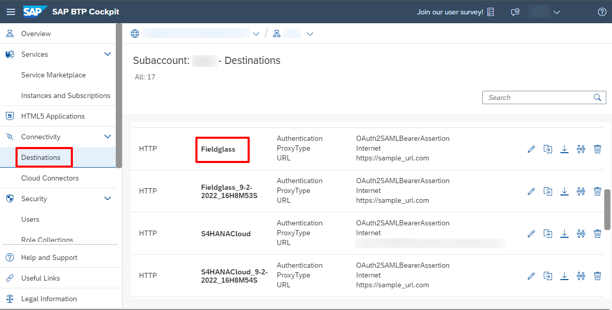
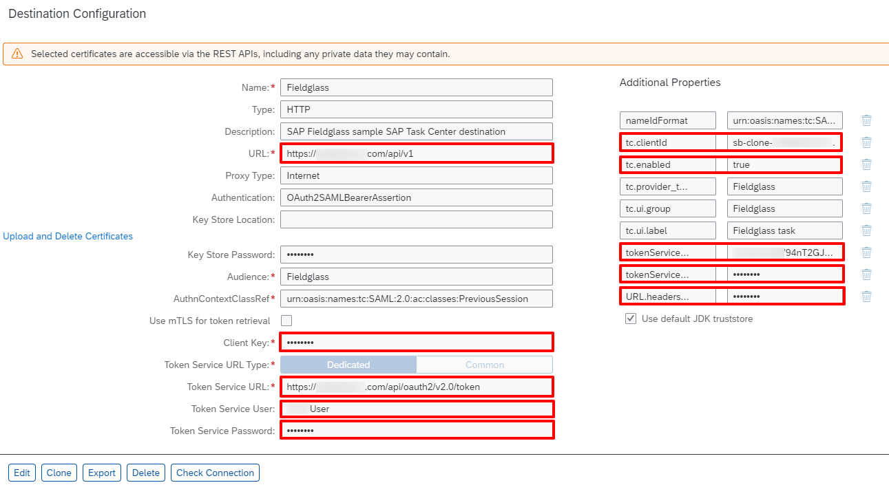

1. Access your BTP Subaccount.  
2. Under **Destinations**, select **Fieldglass** destination that is created when you run the booster to setup Task Center.

3. Edit the pre-created destination and update the properties below:
   * __URL__: https://<**Your Fieldglass Tenant URL**>/api/v1.
   * __Audience__: The Audience is used to construct the SAML assertion. For Example: **Fieldglass**.
   * __Client Key__: Add the **API Application Key** value located on the View Application Keys page in SAP Fieldglass Configuration Manager.
   * __Token Service URL__: https://<**Your Fieldglass Tenant URL**>/api/oauth2/v2.0/token.
   * __Token Service User__: Add the **Virtual Person Name (Username)** value located in the Web Services section on the View Application Keys page in SAP Fieldglass Configuration Manager.
   * __Token Service Password__: Add the **License Key** value located in the Web Services section on the View Application Keys page in SAP Fieldglass Configuration Manager.
   * __Additional Properties__:
        * __tc.enabled__: true  //Click New Property and type property name and value.  Make sure ‘t’ is lowercase in “tc.enabled”.
        * __tc.clientId__: This property is used to enable task updates to be pushed from SAP Fieldglass. The value of this property is the value of the **uaa > clientid** from the service key of the new service instance.
        * __tokenServiceURL.queries.client_id__: Add the **Client ID** value located on the View Application Keys page in SAP Fieldglass Configuration Manager.
        * __tokenServiceURL.queries.client_secret__: Add the **Client Secret** value located on the View Application Keys page in SAP Fieldglass Configuration Manager.
        * __URL.headers.X-ApplicationKey__: Add the **API Application Key** value located on the View Application Keys page in SAP Fieldglass Configu-ration Manager. This value is used when making calls to the URL in this destination.

4. Select the **Use default JDK truststore** checkbox.  
5. Confirm that your setup looks similar to that in the screenshot and **Save** your configuration.
