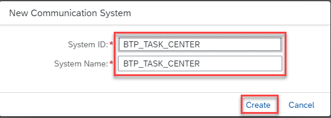

To set up a communication system, proceed as follows:
1. In your SAP BTP subaccount, choose **Destinations >> Download Trust**. A file will be downloaded to your downloads folder. This file is required when creating the communication system in SAP S/4HANA Cloud.

2. Log into your SAP S/4HANA Cloud system and access **Maintain Communication Users**.

3. Choose **New** and create a new communication user. Specify a **User Name**, **Description**, and **Password**. Choose **Create**.

4. Access **Communication Systems**.

5. Choose **New** and specify a **System ID**, **System Name** and choose **Create**.

6. Specify a value for **Host Name** to match your SAP S/4HANA Cloud hostname.  For example, **myXXXXX.s4hana.ondemand.com**.

7. Enable the **OAuth 2.0 Identity Provider** by setting the toggle to **ON**.

8. Choose **Upload Signing Certificate** and upload the file your downloaded from the SAP BTP subaccount in Step 1.

9. Copy the value after **CN=** and paste it in the **OAuth 2.0 SAML Issuer** text box. Switch the **User ID Mapping Mode** to **User UUID**.

10. Choose the **+** sign under **Users for Inbound Communication**.

11. Select the communication, user created earlier, and choose **OK**.

13. Save your communication system.
14. Access **Communication Arrangements**.

15. Choose **New** and choose the value help icon to open the list of available communication scenarios.

16. Search for **SAP_COM_0501** and select it. This communication scenario is relevant for the SAP Task Center integration.

17. Specify an **Arrangement Name** and choose **Create**.

18. Use the value help icon and select the communication system created earlier. The user name for inbound communication should be automatically populated. Confirm that the authentication method is set to **OAuth 2.0** and save your communication arrangement.

19. Choose **OAuth 2.0 Detail** and make a note of the **Client ID**, **Token Service URL** and **SAML2 Audience**. These fields are required to configure the destination settings in the SAP BTP subaccount.

