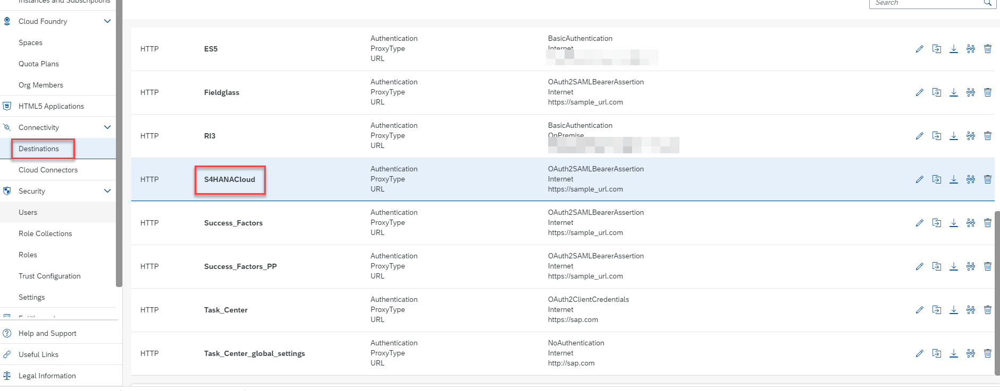
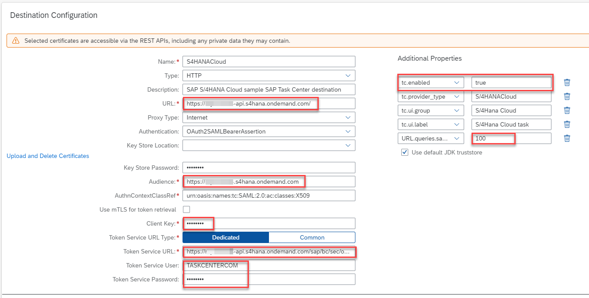

To configure the SAP S/4HANA Cloud destination, proceed as follows:
1. Access your SAP BTP subaccount.
2. Under **Destinations**, choose the **S4HANACloud** destination, that was created when you run the booster to set up SAP Task Center.

3. Edit the pre-created destination and update the properties below:
   * __URL__: &lt;add your SAP S/4HANA Cloud API URL, for example, https://myXXXXX-api.s4hana.ondemand.com&gt;
   * __Audience__: &lt;add the **SAML2 Audience** value, captured from the OAuth 2.0 details in SAP S/4HANA Cloud&gt;
   * __Token Service URL__: &lt;add the **Token Service URL** value, captured from the OAuth 2.0 details in SAP S/4HANA Cloud&gt;
   * __Client Key__: &lt;add the **Client ID** value captured from the OAuth 2.0 details in SAP S/4HANA Cloud&gt;
   * __Token Service User__: &lt; add the communication user, created in SAP S/4HANA Cloud earlier&gt;
   * __Token Service Password__: &lt;add the password for the communication user&gt;
   * __Additional Properties__:
     * __URL.queries.sap-client__: 100
     * __tc.enabled__: true  //Choose **New Property** and type in the property name and value. Make sure ‘t’ is lowercase in “tc.enabled”.
4. Confirm that your setup looks like the one in the screenshot and save your configuration.

