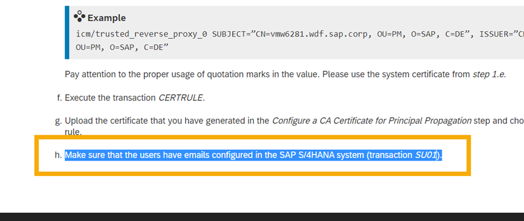

# SAP S/4HANA Integration Scenario with SAP Cloud Identity Services

Make sure you have completed the SAP S/4HANA Cloud integration with Identity Authentication Service (IAS) and Identity Provisioning Services (IPS). This integration prepares all business users for access to SAP Task Center. 

As a prerequisite, you will need to have the SAP Cloud Connector installed and connect SAP S/4HANA as well as IAS and IPS to it.

**Please follow the guides to the up the proper integration between SAP S/4HANA and SAP Cloud Identity Services**

[System Integration Guide for SAP Cloud Identity Service](https://help.sap.com/docs/SAP_CLOUD_IDENTITY/b95c3d5bab324a3a8409eee5267a5b75/dc7ba639647d4ddaa88874eb7656dff1.html)

[Identity Authentication Configuration for SAP S/4HANA](https://help.sap.com/docs/SAP_CLOUD_IDENTITY/b95c3d5bab324a3a8409eee5267a5b75/3b99d58a5ca644028e8ef5a04dc215ad.html)

[Identity Provisioning Configuration for SAP S/4HANA](https://help.sap.com/docs/SAP_CLOUD_IDENTITY/b95c3d5bab324a3a8409eee5267a5b75/7fbca9bcb55e42babe8cf76b6bf77ce3.html)

[Prepare SAP Cloud Connector and SAP S/4HANA for the SAP Task Center Connection](https://help.sap.com/docs/SAP_S4HANA_ON-PREMISE/0f18dddf28764f5b807ecd80549044cc/5c6cf3d9e754468fbd6b3f5073fe085f.html?version=2021.002)

**! Please make sure that the users have emails configured in the SAP S/4HANA system (transaction SU01) !**

