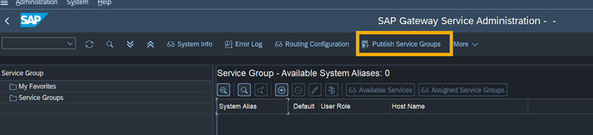

## Publish OData V4 Service Group

You publish the OData V4 service group on the back-end system that is necessary for the SAP Task Center integration.

1. In the Implementation Guide, choose **SAP Customizing Implementation Guide > ABAP Platform > Application Server  Business Management > SAP Business Technology Platform Integration > SAP Task Center Integration.** 

2. Execute the **Publish OData V4 Service Group** activity (alternativly transaction **/IWFND/V4_ADMIN**) to start the SAP Gateway Service Administration

3. Choose **Publish Service Groups**. 

4. Select the back-end system using the value help in the **System Alias** field. *If the system is co-deployed and front-end and back-end system are the same system, then use LOCAL.*

5. Choose **Enter**.

6. In the Service **Group ID** field, enter the **API_TASK_SPI_REPLICATION** service group.

7. Choose **Enter**.

8. Select the entry, and choose **Publish Service Groups**.

9. Choose **Confirm** (checkmark icon ✔).

10. On the **Publish Service Group** dialog, choose **Confirm** again.

11. On the **Information** dialog, choose **Confirm** again.

12. Repeat steps 6 to 11 for the **API_TASK_SPI_DETAILS** service group. 
The service groups are displayed in the menu under **Service Groups**.

ℹ To test the service groups, execute these steps:
-  Select the service groups from the **Service Test** dropdown menu.
-  In the gateway client that opens, choose **Execute** to run the service and check whether a valid response is returned.

ℹ The parth and settings might differ depending on your release version. Please check that you have selected the right version for [Publish OData V4 Service Group](https://help.sap.com/docs/SAP_S4HANA_ON-PREMISE/0f18dddf28764f5b807ecd80549044cc/f188a5ae7723424cabafbf3c80ce0c17.html?version=2021.002) in SAP Help documentation.

ℹ Screenhot from SAP S/4HANA 2020 FPS02 system.