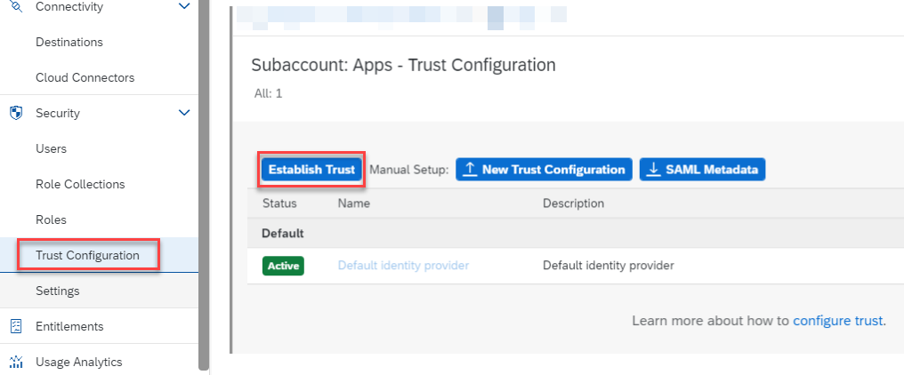
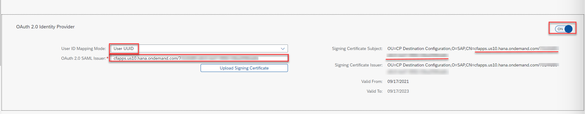
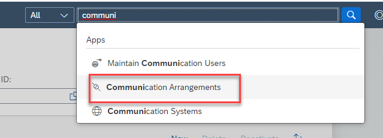
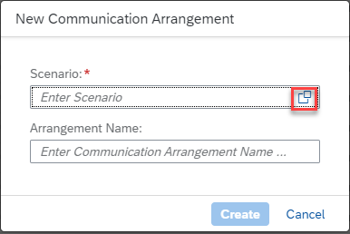

1. In your BTP subaccount, click **Destinations >> Download Trust**.  A file will be downloaded to your downloads folder.  This file is required when creating the communication system in S/4HANA Cloud.

2. Log into your S/4HANA Cloud system and access **Maintain Communication Users**.

3. Click **New** and create a new communication user.  Specify a **User Name, Description, and Password**.  Click **Create**.

4. Access **Communication Systems**.

5. Click New and specify a **System ID**, **System Name** and click **Create**.

6. Specify a value for **Host Name** to match your S/4Cloud hostname.  For eg. **myXXXXX.s4hana.ondemand.com**.

7. Enable OAuth 2.0 Identity Provider by setting the toggle to **ON**.

8. Click **Upload Signing Certificate** and upload the file your downloaded from the BTP subaccount in Step 1.

9. Copy the value after **CN=** and paste it in the **OAuth 2.0 SAML Issuer** text box.  Switch the **User ID Mapping Mode** to **User UUID**.

10. Click **+** under Users for Inbound Communication.

11. . Select the communication user created earlier and click **OK**.

13. Save your Communication System.
14. Access **Communication Arrangements**.

15. Click **New** and choose the value help icon to open up the list of available communication scenarios.

16. Search for **SAP_COM_0501** and select it. This communication scenario is relevant for Task Center integration.

17. Specify an **Arrangement Name** and click **Create**.

18. Use the value help icon and select the **Communication System** created earlier.  The User Name for inbound communication should automatically populate.  Confirm the Authentication Method is set to OAuth 2.0 and save your Communication Arrangement.

19. Click **OAuth 2.0 Detail** and make a note of the **Client ID**, **Token Service URL** and **SAML2 Audience**.  These fields are required to configure the destination settings in the BTP subaccount.

