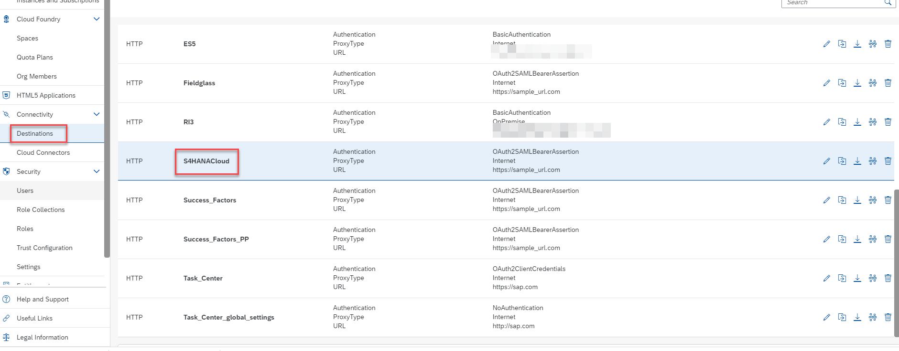
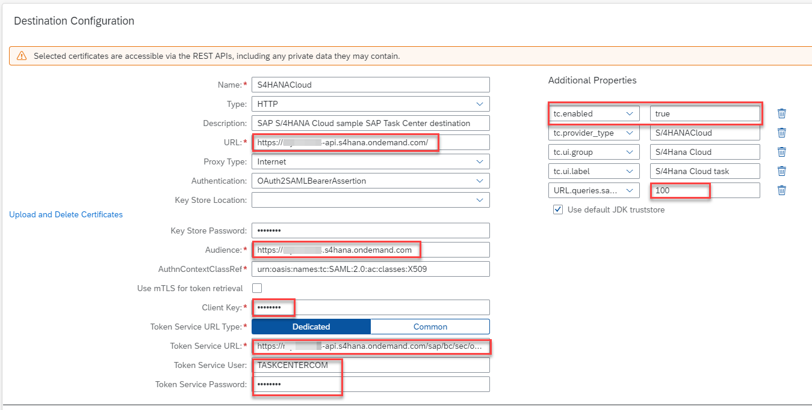

1. Access your BTP Subaccount. 
2. Under **Destinations**, select **S4HANACloud** destination that is created when you run the booster to setup Task Center.

3. Edit the pre-created destination and update the properties below.
   * __URL__: Your S/4HANA Cloud API URL for eg. https://myXXXXX-api.s4hana.ondemand.com.
   * __Audience__: Paste the SAML2 Audience value captured from OAuth 2.0 details in S/4
   * __Token Service URL__: Paste the Token Service URL value captured from OAuth 2.0 details in S/4
   * __Client Key__: Paste the Client ID value captured from OAuth 2.0 details in S/4
   * __Token Service User__: Communication user created in S/4HANA Cloud earlier
   * __Token Service Password__: Password for the Communication User
   * __Additional Properties__:
     * __URL.queries.sap-client__: 100
     * __tc.enabled__: true  Click New Property and type property name and value.  Make sure ‘t’ is lowercase in “tc.enabled”.
4. Confirm that your setup looks similar to the one in the screenshot and **Save** your configuration.

