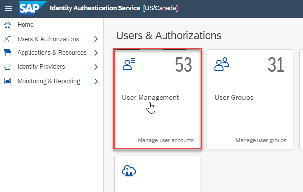
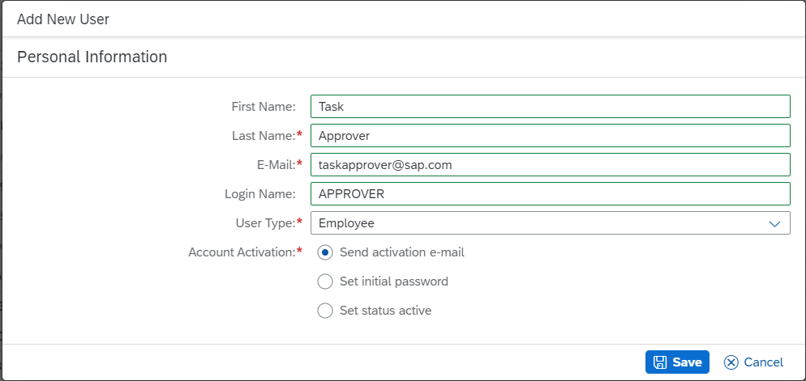
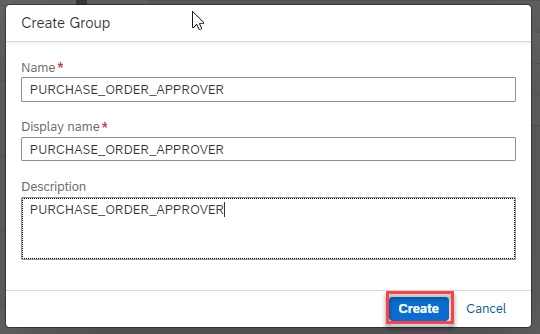
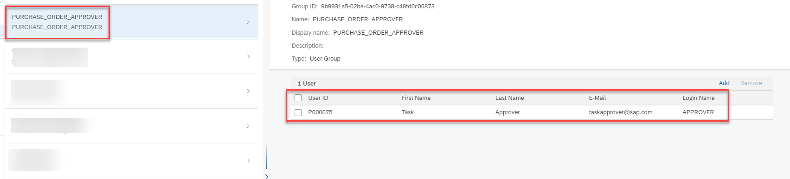

he us
Procedure:

1. Access your Identity Authentication admin console.
2. Click **User Management** tile.

3. Click **+ Add User**.
4. Enter values for **FirstName**, **LastName**, **E-Mail**, **Login Name** fields and click **Save**. An account activation link will be sent to the user's email.

Note: These fields should match the user profile in S/4 HANA Cloud.  The login name(APPROVER) matches the username in SAP S/4HANA Cloud.

5. Activate the user account by following the link sent in the email.
6. Click **User Groups**.
7. Click **Create**.
8. Specify **Name** and **DisplayName** field for the group and click **Create**.  The group name must match the role created in S/4HANA Cloud.  In our case this is called "PURCHASE_ORDER_APPROVER".

9. Select the group you just created from the groups list.
10. Click **Add**, select the "Approver" user created earlier and click **Save**.
11. Confirm the user is added to the group.

