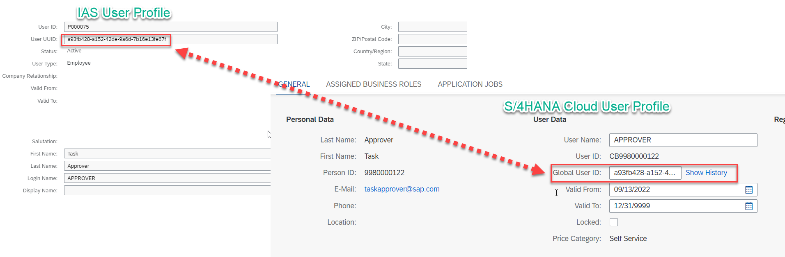
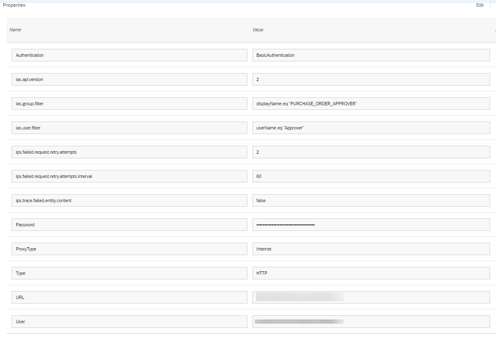

### Introduction

To use SAP Task Center with SAP S/4HANA Cloud, it's important that the SAP S/4HANA Cloud user profile has the **Global User ID** populated with a value that matches the **User UUID** field from the user profile in SAP Cloud Identity Services - Identity Authentication (IAS).

This field will normally be empty after users are onboarded in SAP S/4HANA Cloud. For more information on the SAP S/4HANA Cloud user onboarding process, refer to the links below:
* [SAP S/4HANA Cloud – System Setup](https://blogs.sap.com/2017/12/07/sap-s4hana-cloud-system-setup/)
* [User Management Overview - SAP S/4HANA Cloud Deployment](https://microlearning.opensap.com/media/User+Management+Overview+-+SAP+S+4HANA+Cloud+Deployment/1_26wlxfj9)

For a quick test, you can simply copy the **User UUID** field from Identity Authentication and paste it into the **Global User ID** field in SAP S/4HANA Cloud.  If using the copy and paste option, you may proceed to the next card.  A robust solution to handle this requires using SAP Cloud Identity Services - Identity Provisioning (IPS) to replicate the users from Identity Authentication to SAP S/4HANA Cloud. Identity provisioning also allows you to dynamically control role assignment in SAP S/4HANA Cloud based on the users group membership in SAP Cloud Identity Authentication Service.  This process involves the following steps:
* Creating a communication system in SAP S/4HANA Cloud
* Setting up Identity Authentication as a source system in Identity Provisioning
* Setting up SAP S/4HANA Cloud as a target system in SAP Cloud Identity Provisioning Service
* Running the source provisioning job

### Create a communication system in SAP S/4HANA Cloud

1. Log into your SAP S/4HANA Cloud system and access **Maintain Communication Users**.
2. Choose **New** and create a new communication user.
3. Specify a **User Name**, **Description**, and **Password**.
4. Choose **Create**.
5. Access **Communication Systems**.
6. Choose **New** and specify a **System ID** and **System Name**, and choose **Create**.
7. Specify a value for **Host Name** to match your Identity Authentication tenant hostname. For example, **xxxxxxx.accounts.ondemand.com**
8. Choose the **+** sign under **Users for Inbound Communication**.
9. Select the communication user, created earlier, and choose **OK**.
10. Save your communication system.
11. Access **Communication Arrangements**.
12. Choose **New** and choose the value help icon to open the list of available communication scenarios.
13. Search for **SAP_COM_0193** and select it from the list. This communication scenario is relevant for the Identity Provisioning integration.
14. Specify a name for the arrangement and choose **Create**.
15. Use the value help icon and select the communication system created earlier. The user name for inbound communication should be automatically populated. Save your configuration.

### Setup Identity Authentication (IAS) as a source system in Identity Provisioning (IPS)

1. Access your Identity Authentication admin console.
2. Under **Administrators**, choose **Add >> System**.
3. Specify a name for your user and ensure the following authorizations are enabled:
   * __Manage Users__
   * __Manage Groups__
   * __Manage Tenant Configuration__
4. In the **Set Password** section, choose **Not Configured**.
5. Specify a password for your user and choose **Save**. After saving, you will be redirected back to the previous screen. Navigate back to the password screen and copy the **User ID**, using the **Copy** icon.
7. Access your Identity Provisioning tenant.
8. Choos **Source Systems**.
9. Choose **Add**.
10. Specify the following and save:
    * __Type__: Identity Authentication
    * __System Name__: &lt;add a name of your choice&gt;
11. Choose **Properties** to open the list of pre-created properties.
12. Chooes **Add** to add new properties. Use the standard option for non-sensitive properties and the credential option for password fields.
13. Add the additional properties below and save:
    * __Type__: HTTP
    * __ProxyType__: Internet
    * __URL__: &lt;add your Identity Authentication tenant URL&gt;
    * __Authentication__: BasicAuthentication
    * __User__: &lt;add the system user created in Identity Authentication earlier&gt;
    * __Password__: &lt;add the password for the system user&gt;
    * __ias.group.filter__: displayName eq &lt;group created in Identity Authentication&gt;
    * __ias.user.filter__: useName eq &lt;user created in Identity Authentication&gt;

Note: User and Group filter is recommended for testing to restrict which users and groups will be read from SAP Cloud Identity Authentication Service and provisioned to SAP S/4HANA Cloud.

### Setup SAP S/4HANA Cloud as a target system in Identity Provisioning
1. Access your Identity Provisioning tenant.
2. Choose the **Target System** icon and choose **Add**.
3. Specify the following and save:
   * __Type__: SAP S/4HANA Cloud
   * __System Name__: &lt;add a name of your choice&gt;
   * __Source System__: &lt;add the Identity Authentication source system created earlier&gt;
 4. Choose **Properties** to open the list of pre-created properties.
 5. Choose **Add** to add new properties. Use the standard option for non-sensitive properties and the credential option for password fields.
 6. Add the additional properties below and save:
    * __Type__: HTTP
    * __ProxyType__: Internet
    * __URL__: &lt;add your SAP S/4HANA Cloud URL&gt;
    * __Authentication__: BasicAuthentication
    * __User__: &lt;add the communication user created in the SAP S/4HANA Cloud system earlier&gt;
    * __Password__: &lt;add the password for the communication user&gt;

### Run the source provisioning job
1. Switch to **Source Systems**. 
2. Select your source job and choose the **Jobs** icon. 
3. Choose the **Run Now** icon to start the **Read** Job.
4. Monitor the status under **Job Logs** until you see a **Success** status. You will need to navigate away and come back to this page to see the updated status.
5. View the details of the job execution and confirm users and groups were provisioned successfully.
6. Log into your SAP S/4HANA cloud system, and confirm that the **Global User ID** is populated for the business users.
