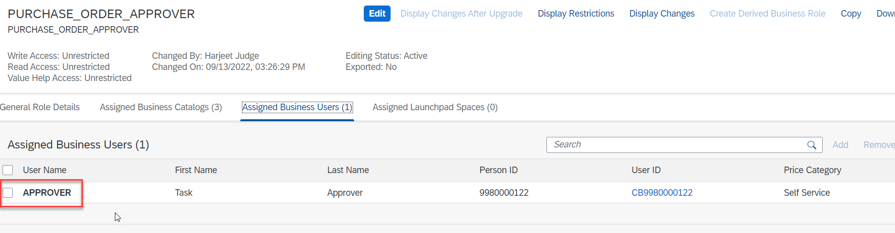

The user who will approve or reject tasks from SAP S/4HANA Cloud in SAP Task Center requires certain privileges in the SAP S/4HANA Cloud system. For this mission, we will setup the authorization necessary to handle a purchase order approval tasks in SAP Task Center.  For Task Center the user must be assigned to a business role that contains the **Business Process Management - Task Center** catalog item.  This role is required above and beyond any roles required for purchase approvals.

Procedure:

1. Log into your SAP S/4HANA Cloud system.
2. Access **Maintain Business Roles**.

4. Pick an existing business role (for example, **PURCHASE_ORDER_APPROVER**).
5. Confirm the **Business Process Management - Task Center** business catalog is added to the role.
6. If required, add the **Materials Management-Purchase Order Approval** and **Master Data-Supplier Display** role.  

7.  Confirm the role is assigned to the user who will approve/reject purchase orders.

