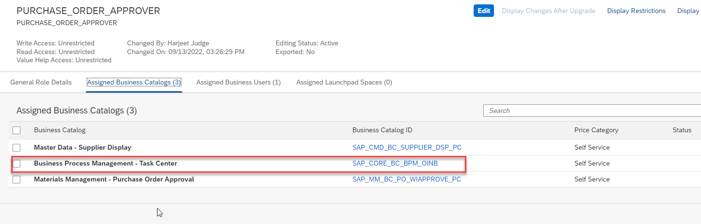

The user who will approve/reject tasks from SAP S/4HANA Cloud in SAP Task Center will require certain privileges in the S/4HANA Cloud system.  Specifically, the user must be assigned to a business role that contains **Business Process Management - Task Center**  catalog item.

1. Log into your SAP S/4HANA Cloud system.
2. Access **Maintain Business Roles**.

3. Pick an existing business role (eg. BR Employee) assigned to user who will log into SAP Task Center to approve/reject tasks.
4. Confirm the **Business Process Management - Task Center** business catalog is added to the role.

