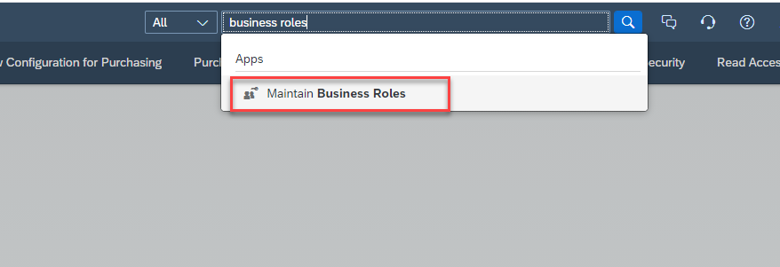

### Introduction

The user who will approve/reject tasks from SAP S/4HANA Cloud in SAP Task Center will require certain privileges in the S/4HANA Cloud system.  Specifically, the user must be assigned to a business role that contains **Business Process Management - Task Center**  catalog item.

1. Access your SAP S/4HANA Cloud system.
2. Access **Maintain Business Roles**.

3. 
