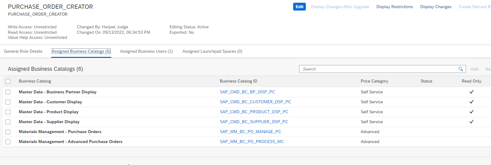
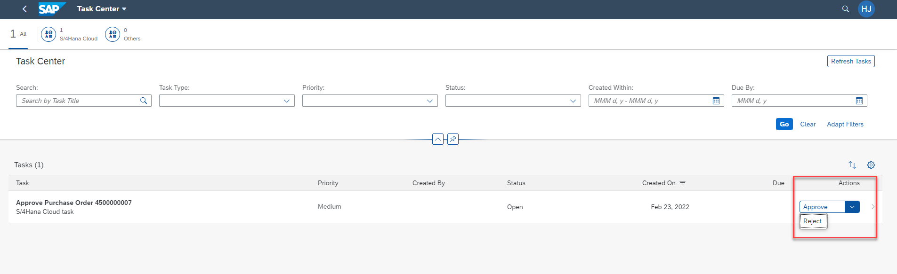

Test your integration with the following steps:

1. Log into your SAP S/4HANA Cloud system as user who can can create puchase order approval tasks. The user will need a business role assigned that has the priviliges shown in the screenshot below.
 
3. Access **Manage Purchase Order** application in SAP S/4HANA Cloud and create a new purchase order.

2. Log on as the respective task approver to SAP Task Center and choose the **Task Center** tile.

3. Choose on the task to view the task details, or choose to **Approve/Reject** the task.

