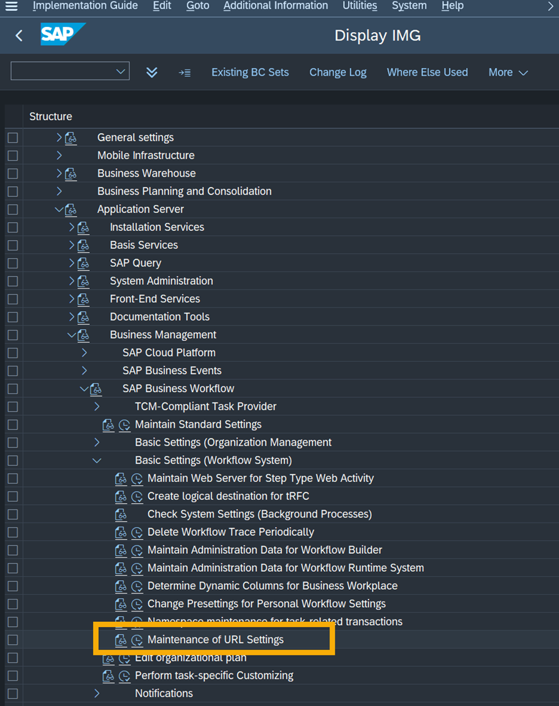
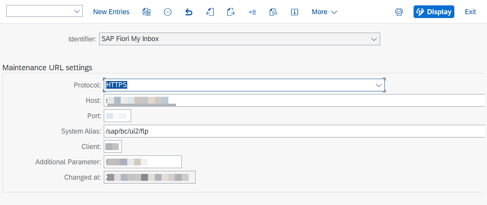

## Maintain URL Settings for SAP Business Workflow

To process certain tasks the users must be able to navigate back from SAP Task Center to the "My Inbox" app of SAP S/4HANA system. Therefore, you must configure details about your front-end system.

1. In the Implementation Guide (Transaction **SPRO**), choose *SAP Customizing Implementation Guide > ABAP Platform > Application Server  Business Management > SAP Business Workflow > Basic Settings (Workflow System). i*

2. Execute the IMG activity Maintenance of URL Settings. The following parameters must be configured: 

| Parameter | Field | Remark
| --- | ----------- |---|
| alias | System Alias | The administration manual for the SAP Fiori Launchpad provides a description of how the launchpad URL can be configured (see SAP Help Portal). The default alias /sap/bc/ui2/flp/FioriLaunchpad.html should work as long as it is not blocked by the system |
| host | Host | The host name of the SAP Fiori Launchpad server (FQDN of MyInbox) |
| port | Port | The port of the SAP Fiori Launchpad server |
| protocol | Protocol | Permitted values: http or https |
| sapClient | Client | Client of the Fiori Launchpad server |
| sapOrigin | Additional parameter | The alias of the back-end system maintained on the Gateway server

Hint: Transaction code /n/ui2/flp can be executed to retrive the host name and port number for the respective SAP Fiori Launchpad server.

*The configuration can be tested in this activity. The test can only be performed in display mode, as this is only possible for saved data.  The test UI displays the URL if a configuration has been saved and the work item exists in the system. You can test the URL by double-clicking it or copying it to the address bar in the browser.*

i The path and settings might differ depending on your release version. Please check that you have selected the right version for [Maintain URL Settings](https://help.sap.com/docs/SAP_S4HANA_ON-PREMISE/0f18dddf28764f5b807ecd80549044cc/bb442e2c95ca4aad8285b214265b2ef0.html?version=2021.002) in the SAP Help Portal documentation. 

ℹ Screenshot from SAP S/4HANA 2020 FPS02 system.

