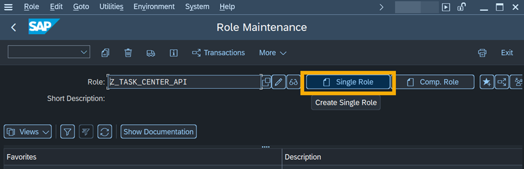
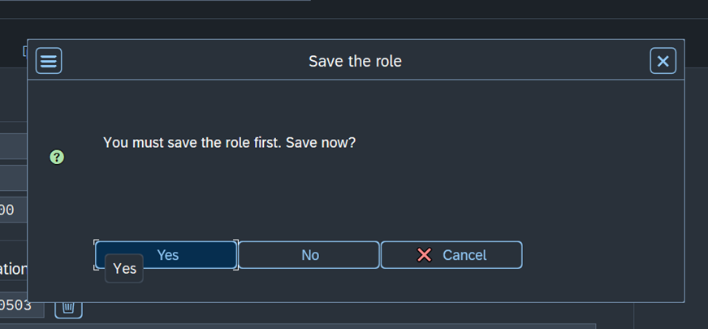

## Create Role for Technical User for Task Pull Service
Create an authorization role on your back-end system for granting access to the task pull service.

1. Start transaction **PFCG**, and enter the name of the role. Then choose **Role > Create Single Role**.

    

2. On the **Menu** tab, choose **Authorization Default** from the **Insert Node** menu.

    

3. In the **Authorization Default** field on the **Service** popup, select **SAP Gateway OData V4 Backend Service Groups & Assignments**.

    

4. In the **TADIR Service** field, select the **(G4BA) API_TASK_SPI_REPLICATION** service using the value help.

    

5. Choose **Apply**, then **Copy**.

    

6. The **Role Menu** contains the added entry.

7. On the **Authorizations** tab, choose **Expert Mode for Profile Generation**.
    
    

    

    
    
8. **Save** and **generate** the role.
    
    

i The path and settings might differ depending on your SAP S/4HANA release version. Please check that you have selected the right version for [Create Service User for Task Pull Service](https://help.sap.com/docs/SAP_S4HANA_ON-PREMISE/0f18dddf28764f5b807ecd80549044cc/229c5a1f659341efa2bb6205159d6209.html?version=2021.002) in the SAP Help Portal documentation.

ℹ Screenshot from SAP S/4HANA 2020 FPS02 system.

